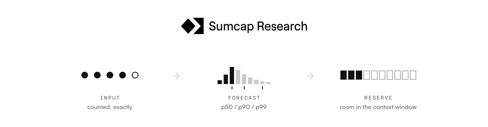

# Token Forecaster.

Token Forecaster estimates how many output tokens a Claude reply, or a whole agent turn, is likely to use, then shows how the reply is tracking against that range while it runs. It starts from a bundled Claude Code prior and can fit itself to your own local history.

**Use it to reserve room in the context window, spot agent loops that are running long, and decide when a task is worth splitting.**

*Research preview: the bundled calibration is fitted on one user's Claude Code history. Treat it as a prior, not a promise about your workload.*

| Contents | |
|---|---|
| [What you see](#what-you-see) | [Does it transfer](#does-it-transfer) |
| [How the forecaster works](#how-the-forecaster-works) | [Forecasting the whole turn](#forecasting-the-whole-turn) |
| [What it is predicting](#what-it-is-predicting) | [Privacy and data flow](#privacy-and-data-flow) |
| [Does it calibrate](#does-it-calibrate) | [Build from source](#build-from-source) |
| [What actually helps](#what-actually-helps) | [Using it](#using-it) |
| [How changes are admitted](#how-changes-are-admitted) | [Using the predictor as a library](#using-the-predictor-as-a-library) |
| [What failed the gate](#what-failed-the-gate) | [Limits and the next experiment](#limits-and-the-next-experiment) |
| [Where the errors come from](#where-the-errors-come-from) | [Reproduce, repository, cite](#reproduce-repository-cite) |
| [Does it survive drift](#does-it-survive-drift) | [Credits](#credits) |

## What you see

Token Forecaster runs on four surfaces, all fed by one local daemon: the Claude Code status line, a macOS menu bar app, a local dashboard, and a Chrome extension for claude.ai/code.

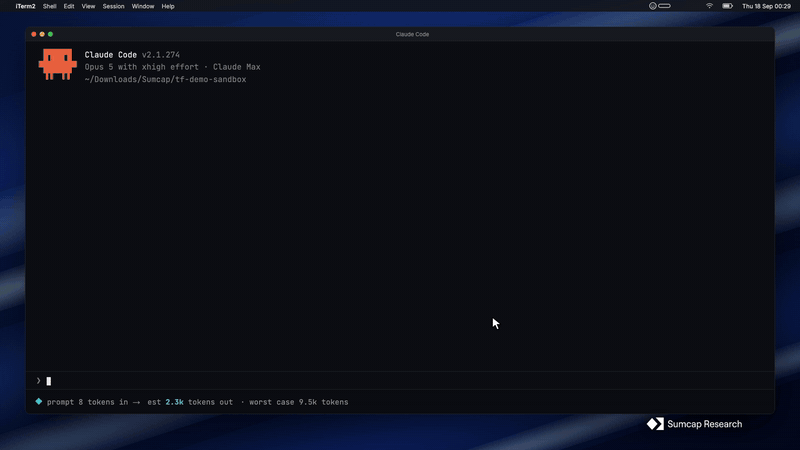

*Animated walkthrough. Every number in it is from a real session on 17 Sep 2026.*

**Status line.** In Claude Code while a reply is being written, then between turns, then while you are still typing through the `tf-claude` launcher:

```text
◆ 15k tokens out  ·  ▓▓▓░░░░░░░ typical  ·  usual 22k tokens  ·  ctx 41%  ·  $0.42
◆ last turn 18k tokens out  ·  ▓▓▓▓▓▓▓▓▓░ running long  ·  next turn est 2.9k tokens out  ·  ctx 13%  ·  $5.52
◆ prompt 3 tokens in → est 2.7k tokens out  ·  worst case 29k tokens  ·  ctx 13%
◆ prompt 103 tokens in → est 4.6k tokens out  ·  worst case 27k tokens  ·  ctx 13%
```

`typical` means below your p50, `running long` between p50 and p90, `very long` past p90. The dollar figure is what Claude Code has billed this session so far. It is not a forecast.

**Menu bar.** The glyph is a face and a meter. The face smiles while the live turn is at or under your p50, goes flat between p50 and p90, and frowns past p90; the meter fills as the reply grows. Click it for the state in words, the p50 and p90 behind it, the call count, and an Accuracy strip: one bar per finished turn against the forecast it was given, solid line p50, dotted line p90, so a calibrated forecaster looks like noise around the line rather than a trend. Under it, how often turns came in under the estimate and under the worst case. Open dashboard (⌘D) and Rebuild profile (⌘R) are the two actions; Settings holds the switches listed under [Using it](#using-it).

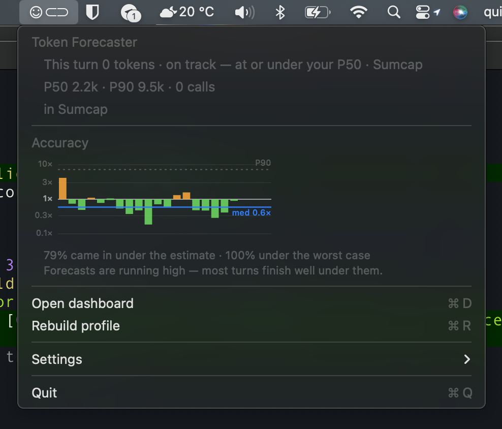

**Dashboard.** A local page the daemon serves on 127.0.0.1. Status shows what one task usually costs you (p50, p90 and p99 of your own tasks) and the four things that have to be true before the numbers are yours: Codex connected, Claude Code connected, personal model trained, and whether the personal model beats the generic one, per forecast type. Accuracy shows whether the forecasts covered what they promised (a "9 in 10" range should be right 9 times in 10) and how much better than generic the personal model is. Data needed lists what is still missing for each forecast type.

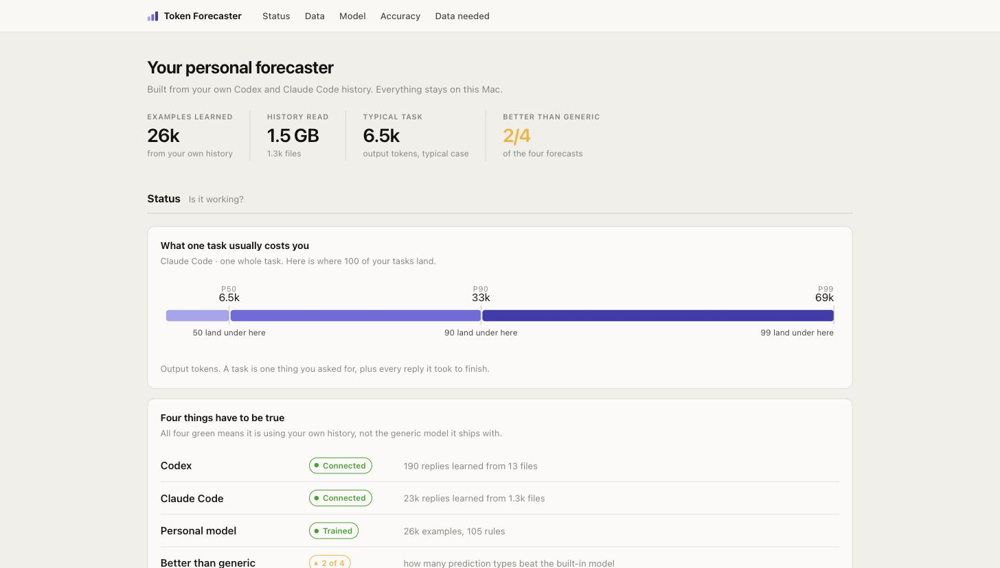

**Chrome extension.** A pill above the composer on claude.ai/code: input tokens, the p50 to p90 output band, then a context meter. The forecast is frozen at the moment you send, the reply is scored against it as it arrives, and the panel keeps a running total for the whole conversation.

```text
● 6 in · ~348-1.4k out ▁▁▁ 6%
```

Its panel ends with: "Fitted on one person's Claude Code agent traffic, which is the work this page does. Read these as a prior for this kind of work, not a promise about how you write." Confidence is capped at `low` on both extension surfaces.

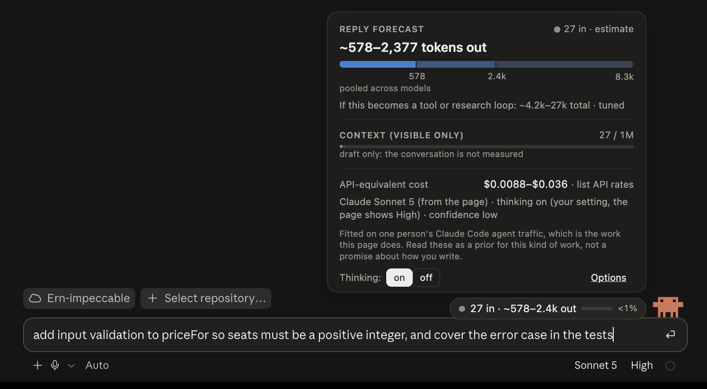

## How the forecaster works

Input tokens are counted, not guessed: Anthropic's count endpoint gives the exact number and a local estimate covers the gap while you type. Output tokens are forecast from history. The predictor is a lookup table over your past replies, grouped by model and by whether extended thinking was on, and it walks from the most specific group to the broadest until one has enough samples. A small trained correction then nudges the three quantiles using what the agent loop has already done: how deep it is, how many calls so far, whether a Write already happened. The predictor never sees the prompt text; the launchers reduce your draft to a few counts locally and keep nothing raw. The forecast leans high on purpose, because a token of shortfall is priced nine times a token of slack. After the call, the true length grades the forecast, and a change ships only if it beats the current predictor on held-out calls with the whole confidence interval below zero.

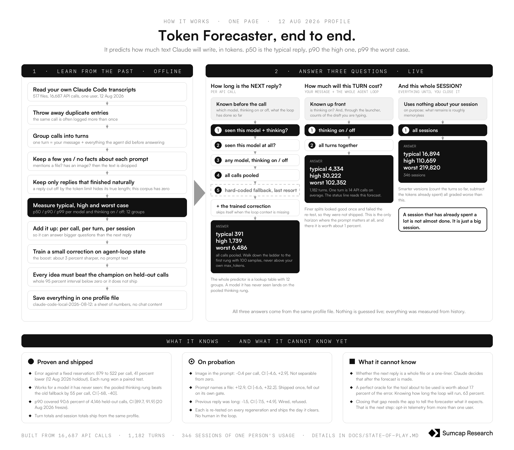

*The whole system on one page: learn from the past offline, answer three questions live, and what it knows and cannot know. 12 Aug 2026 · bundled profile.*

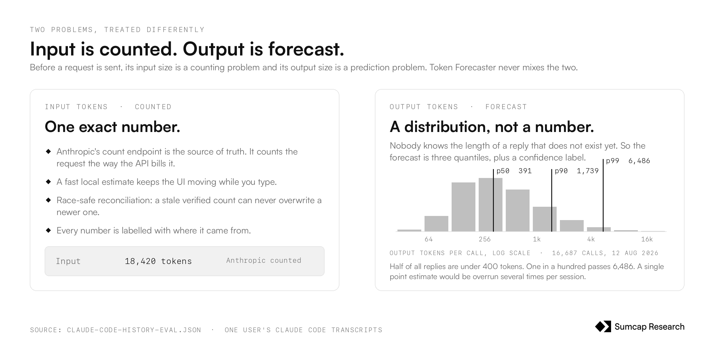

*Two problems, treated differently. Input is a counting problem with an exact answer. Output is a forecasting problem, so the answer is a distribution. 12 Aug 2026 · 16,687 calls.*

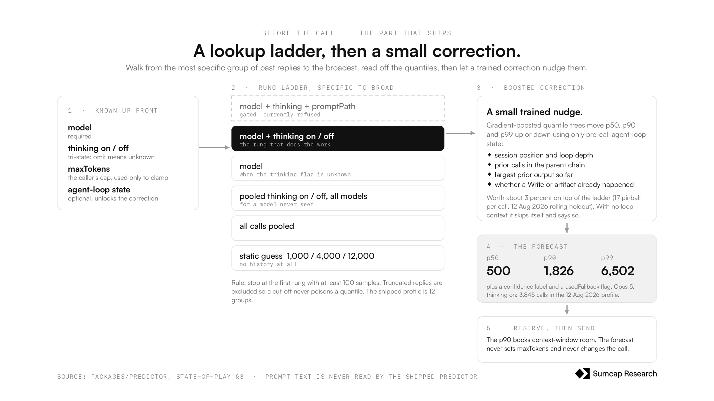

*The part that ships. The request walks from specific to broad and the first group with at least 100 samples answers: model + thinking + a prompt bit (gated, empty today), model + thinking, model, thinking pooled across models, prompt bits pooled, all calls pooled, then a static guess of 1,000 / 4,000 / 12,000, the only hand-typed quantiles in the predictor. The 12 Aug 2026 profile ships 12 groups. Truncated replies are excluded so a cut-off never poisons a quantile.*

On top of the rung sits a small trained correction: gradient-boosted quantile trees (depth 3, 48 rounds, feature schema `portable-precall-v2`, 16,687 training calls) that read agent-loop state and prompt aggregates, never text: session position, loop depth, prior call count, the largest prior output, whether a Write or an artifact already happened. It applies only on a model rung with the thinking flag known and the loop context complete. On five rolling folds it cuts loss by 17.4 pinball per call, CI [-26.5, -8.4] (12 Aug 2026; negative is better, and that convention holds for every gate result below). The loss is pinball loss at p50, p90 and p99, summed. A token of shortfall costs 9x a token of slack at p90 and 99x at p99, so the band leans toward over-reserving by construction.

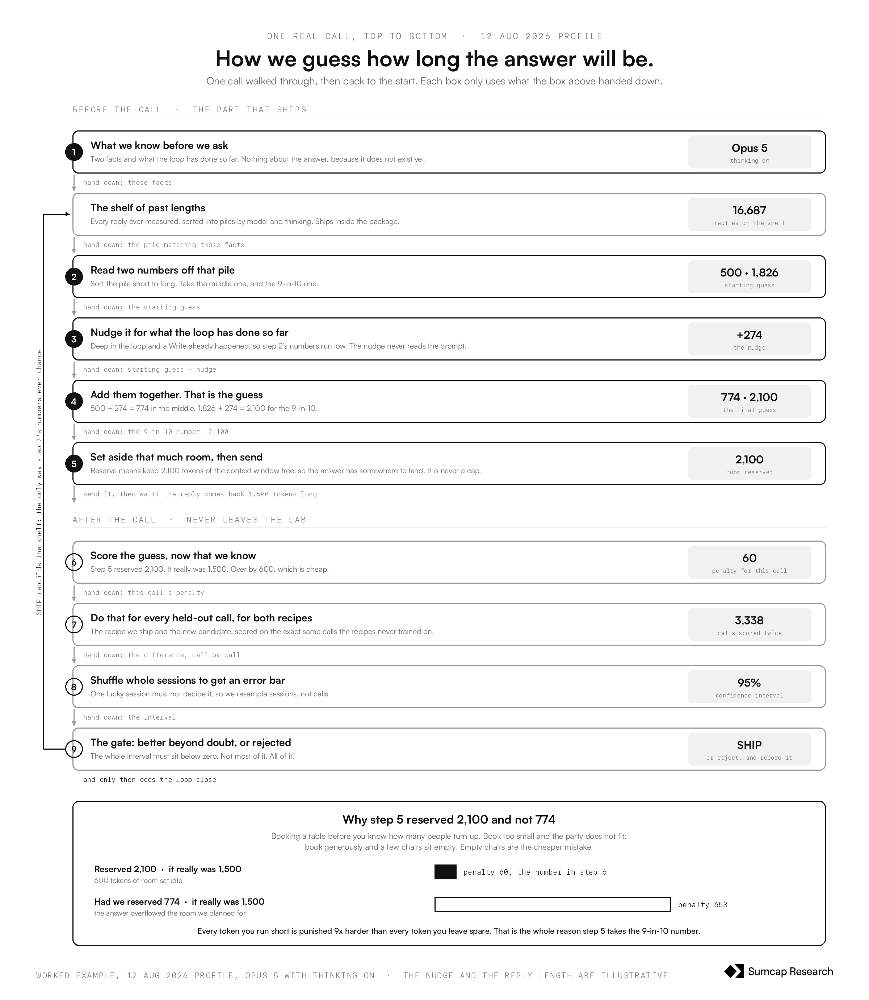

*One call, top to bottom, then back to the start. Opus 5 with thinking on, 12 Aug 2026 profile; the nudge and the reply length are illustrative.*

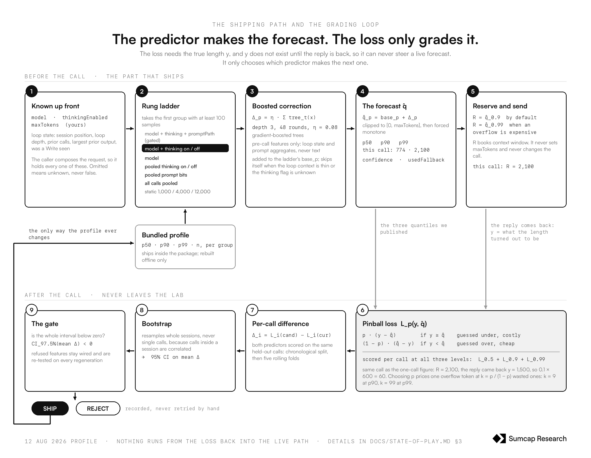

*The same nine steps with the actual mechanics. Nothing runs from the loss back into the live path.*

## What it is predicting

Three horizons ship from the same profile. Per API call, the forecast is the next reply. Per turn, it is everything the agent does before it answers you, which is where the status line reads from. Per session, it is everything until you close it, and that one is unconditional on purpose.

| Horizon | p50 | p90 | p99 | n |
|---|---|---|---|---|
| One API call | 391 | 1,739 | 6,486 | 16,687 calls |
| One user turn, the whole agent loop | 4,334 | 30,222 | 102,352 | 1,182 turns |
| One session | 16,894 | 110,659 | 219,820 | 346 sessions |

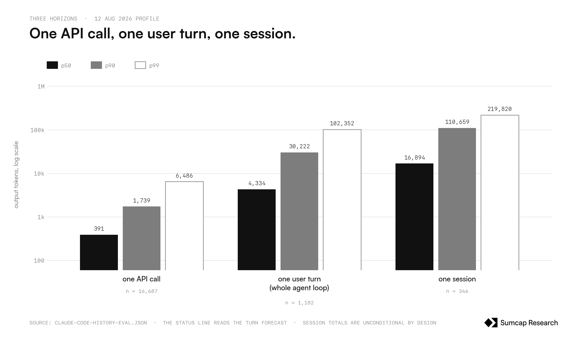

*Output tokens at three horizons, log scale. 12 Aug 2026 · bundled profile · one user. The longest single reply in the corpus was 32,709 tokens.*

Half of all replies are short and one in a hundred is very long. That long tail is why a single point estimate would be useless: any number small enough to be a good typical guess would be overrun several times per session. Remaining session output is roughly memoryless. Subtracting what was already spent from the session total graded worst of every candidate (10 Aug 2026, 311 sessions).

*Every chart below names the snapshot it was measured on. The corpus grows every day the author works, so paired comparisons on one dated snapshot are the stable statements. The two that matter most are the bundled profile `claude-code-local-2026-08-12` (16,687 calls) and the external evaluation frozen on 20 Aug 2026 (21,160 calls).*

## Does it calibrate

A p90 forecast is only worth something if about nine in ten real replies fit under it. On calls the predictor never trained on, they do:

| What was measured | Result | Where |
|---|---|---|
| Held-out calls under the p90 line | 90.6 percent, CI [89.7, 91.9] | 20 Aug 2026 evaluation, 4,146 calls in 47 sessions the model never saw |
| Held-out calls under the p99 line | 98.6 percent, CI [98.2, 99.2] | same |
| The known weak spot: heaviest fifth of forecasts | p90 covers 85.8 percent, CI [82.9, 89.2] | same |
| Error against a fixed reservation | 41 percent lower (879 to 522 pinball loss per call) | bundled profile, chronological holdout of 3,338 calls |
| Band width at equal coverage | 7 to 14 percent narrower than pooling all calls | 20 Aug 2026 evaluation |

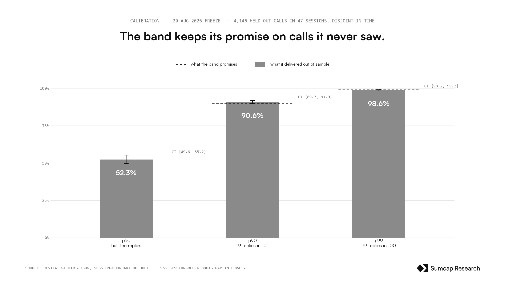

*Promised versus observed coverage at p50, p90 and p99. 20 Aug 2026 evaluation · 21,160 calls · holdout of 4,146 calls in 47 sessions, disjoint in time · 95 percent session-block bootstrap.*

Reviewer freeze of 20 Aug 2026, 21,160 calls in 402 sessions. Holding out whole sessions at the end of the record (4,146 calls in 47 sessions), the p90 line covered 90.6 percent of held-out calls, 95 percent CI [89.7, 91.9], and the p99 line 98.6 percent [98.2, 99.2]. Cutting at the last 20 percent of calls instead (4,232 calls in 48 sessions) gives 90.5 percent [89.6, 91.7]. At matched coverage the shipped band is 7 to 14 percent narrower than pooling all calls, and pinball loss is 15 percent lower (840 to 718). In the heaviest expected-size quintile p90 coverage is 85.8 percent [82.9, 89.2]; the shortfall there is real.

## What actually helps

The thinking flag is the signal that paid. Pooled across models on the 12 Aug 2026 profile, thinking on gives 578 / 2,377 / 8,313 and thinking off gives 216 / 887 / 3,309. Extended thinking is billed as output, so the effect is mechanical. The model itself moves the numbers less.

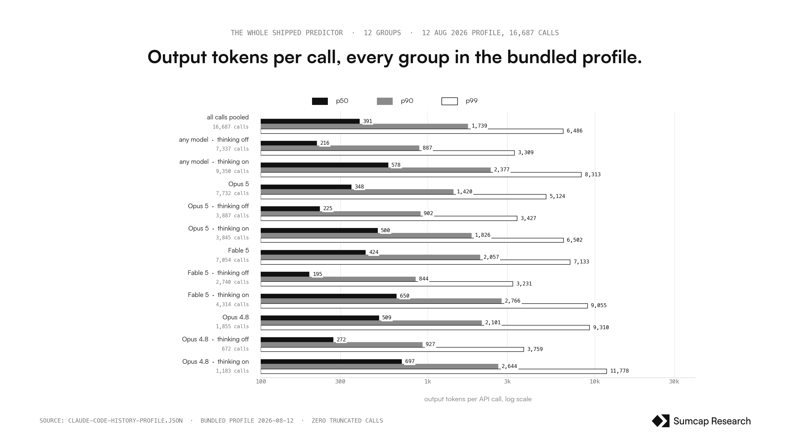

*The whole shipped predictor is this lookup table: p50, p90 and p99 for every group. 12 Aug 2026 · 16,687 calls · zero truncated.*

9 Aug 2026 probe, 2,996 held-out calls. Pinball loss per call by what the caller declares: full local history 505.4, model plus thinking flag 508.5, model only 549.3, nothing 568.8. A cold caller that passes the thinking flag loses 3.0 per call, CI [-5.3, +10.9], which is noise. Dropping the flag costs 40.8, CI [+28.0, +52.8]. For a model the profile has never seen, the pooled thinking rung beats the old blended fallback by 54.9 per call, CI [-68.2, -39.9], leave-one-model-out.

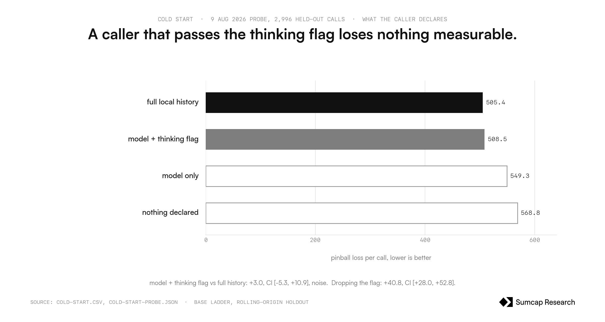

*Pinball loss per call by what a fresh caller passes in. 9 Aug 2026 probe · 2,996 held-out calls · base ladder.*

## How changes are admitted

After the call, the actual usage is recorded as aggregates and the evaluation reruns. A change ships only when it beats the current predictor on the same held-out calls under a paired session-block bootstrap (2,000 resamples) with the entire 95 percent confidence interval below zero. Blocks are sessions, not calls, because calls inside a session are correlated. Refused features stay wired, are re-tested on every regeneration, and ship the day they clear. The gate runs inside the evaluation script, not in prose.

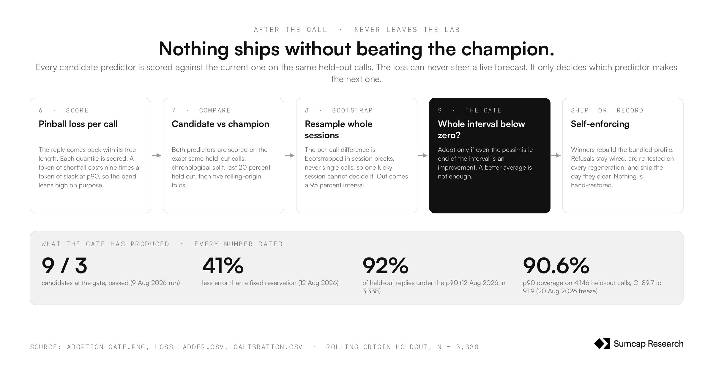

*Score, compare, bootstrap, gate. The loss can never steer a live forecast; it only chooses which predictor makes the next one.*

12 Aug 2026 profile, chronological split, 3,338 held-out calls. Pinball loss per call: fixed numbers 879.0, own history 567.2, plus which model 555.9, plus the thinking flag 520.3, plus the boosted correction 522.3. That is 41 percent below a static reservation. The last rung is not monotone on this split; the correction earns its place on the rolling test.

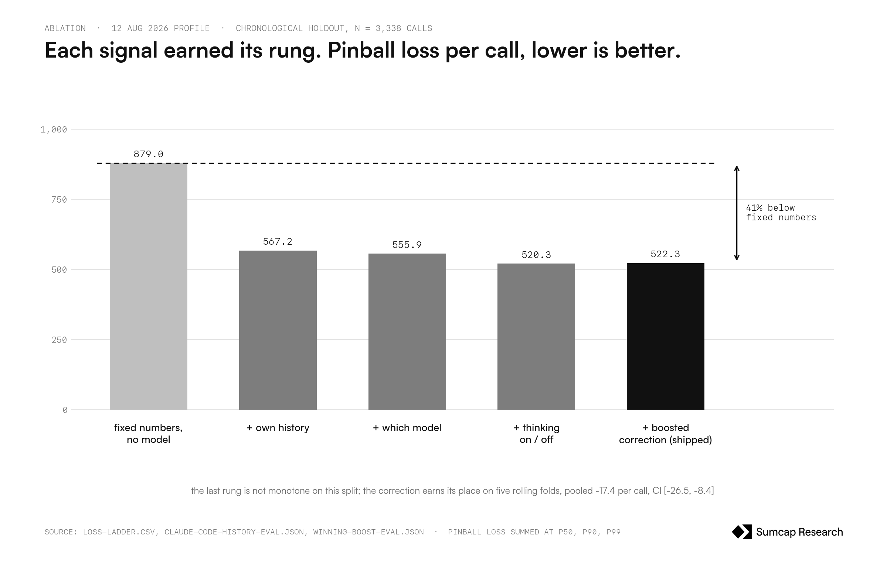

*Pinball loss per call as each signal is added. 12 Aug 2026 · chronological holdout · 3,338 calls.*

Five rolling-origin folds, 12 Aug 2026: the shipped predictor has lower loss in all five, but only two clear the gate on their own. The pooled comparison decides: -17.4 per call, CI [-26.5, -8.4]. Rolling coverage is 53.8 / 92.0 / 98.9 percent at p50 / p90 / p99.

The gate itself is a finding. A five-fold paired t-test adopted and refused the same feature twenty minutes apart (3 to 4 Aug 2026). The paired session-block bootstrap replaced it, and the prompt-path rung that shipped and fell out on 9 Aug 2026 is the gate working as designed.

## What failed the gate

Most ideas did not make it, and the rejections are kept on record so they are not retried by accident. Per-call candidates carry the pinball-loss difference against the shipped ladder with its 95 percent CI, negative is better.

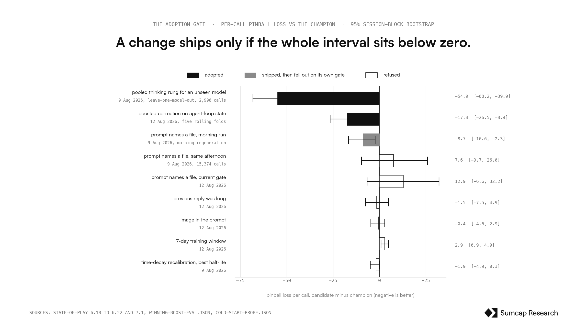

*Every per-call candidate as a difference against the champion with its 95 percent interval. Black shipped, grey shipped and fell out on its own gate, outlined refused. 9 to 12 Aug 2026 · session-block bootstrap.*

- Prompt mentions a file path: shipped on the morning of 9 Aug 2026 at -8.66 per call [-16.59, -2.32], fell out that afternoon at +7.63 [-9.72, +25.96]; +12.9 [-6.6, +32.2] on 12 Aug 2026.
- Prompt carries an image: -0.4 [-4.6, +2.9]. Previous call's output length: -1.5 [-7.5, +4.9] (12 Aug 2026).
- Input size made the tail worse (5 Aug 2026). Tool availability is a constant for an agent and Claude Code transcripts record no tool count, so that dimension was deleted unmeasured. Effort level showed a 4.6x naive gap that vanishes inside (day, model) cells (3 Aug 2026).
- Recency windows: 7 days is provably worse, +2.9 [+0.9, +4.9]; no window beat full history (12 Aug 2026). Split-conformal and time-decay recalibration: no variant clears; the best decay reads -1.9 [-4.9, +0.3] (9 Aug 2026).

The full record is the numbered experiment ledger in [docs/STATE-OF-PLAY.md](docs/STATE-OF-PLAY.md); each scripted probe carries its confidence interval and reproduce command.

## Where the errors come from

The error is thirty calls, not fog. On the 5 to 6 Aug 2026 holdouts the worst 1 percent of calls carried 23 to 25 percent of the loss, mostly Write calls: about 3 percent of traffic and 9.8x over-represented among the worst misses. A perfect oracle for the tool about to be used is worth about 17 percent of the loss. The best leakage-free pre-call detector reached AUC 0.58 (6 Aug 2026).

## Does it survive drift

Forecasts run high because the workload shrinks. Corpus p50 by fortnight from 2 Jul 2026: 510, 429, 347 (9 Aug 2026 probe, `calibration-probe.json`). Fitted quantiles overshoot same-group holdout by about 1.25x at p50 (9 Aug 2026), which errs in the safe direction. No rolling window or time-decay beat full history at the gate, so the profile is refit on full history at every regeneration.

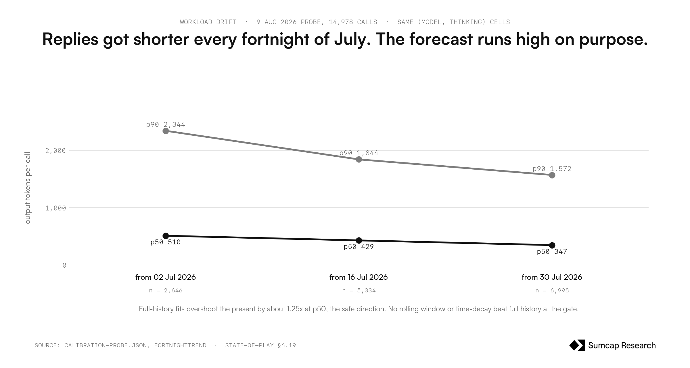

*Corpus p50 and p90 by fortnight within the same model and thinking cells. 9 Aug 2026 probe · 14,978 calls.*

## Does it transfer

One person's fit does not transfer. Holding the person fixed and swapping projects (26 Aug 2026 tree, 23,368 calls, 20 projects), p90 coverage on the four projects that met the gate's size rule (15 or more sessions and 300 or more calls) ran 95.4 / 80.9 / 88.1 / 88.2 percent and the rescale needed to restore 90 percent ran from 0.67x to 1.73x. Loss transfers; calibration does not.

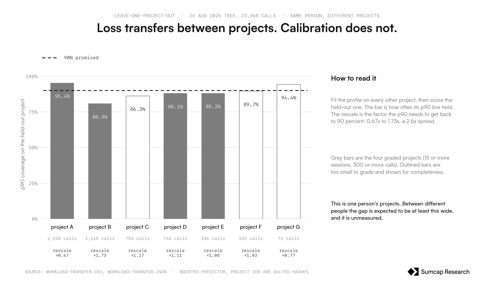

*p90 coverage on each held-out project when the profile is fitted on the others, with the rescale that restores 90 percent. 26 Aug 2026 tree · 23,368 calls · 20 projects, 7 large enough to score.*

This is the crucial limitation. Between users, calibration is unmeasured, and the gap is expected to be at least as wide as it is between one person's projects. The next experiment, below, exists because of this chart.

**A second user, 17 Sep 2026.** One other person ran the index and the evaluation on their own machine and history, unchanged code. The daemon indexed 1,324 Claude Code files, 23,415 usable calls, in 17 seconds and fitted a personal profile. On a chronological 70/30 holdout of that history (7,025 calls scored) the personal profile's p90 line covered 88.3 percent of held-out calls against 80.9 percent for the bundled cold-start prior, with pinball loss per call 394 against 455. On whole turns (640 scored) the best personal candidate reached 80.6 percent p90 coverage; the bundled prior 79.8 percent. Two of the four forecast types beat the generic model on that machine. One user, one run, no confidence intervals yet: the logs are in [docs/second-user-1709/](docs/second-user-1709/).

## Forecasting the whole turn

The prompt predicts the turn, never the call. Prompt features were refused for the per-call forecast (best variant +14.5 [-2.3, +29.0], 12 Aug 2026). On whole-turn totals a draft that reads "can you write" forecasts 3,564 / 24,884 at p50 / p90 and the full intent 9,054 / 38,283 (12 Aug 2026, 1,182 turns).

Re-forecasting as the loop runs is real but small: -4.7 percent [-7.6, -1.9] after one completed call, -10.2 percent [-13.9, -7.0] after five (3 Sep 2026, 2,245 turns). An oracle that knows how the loop will run gets -62.9 percent [-70.8, -55.5] (context probe, 3 Sep 2026, 2,225 turns), so loop duration is the ceiling.

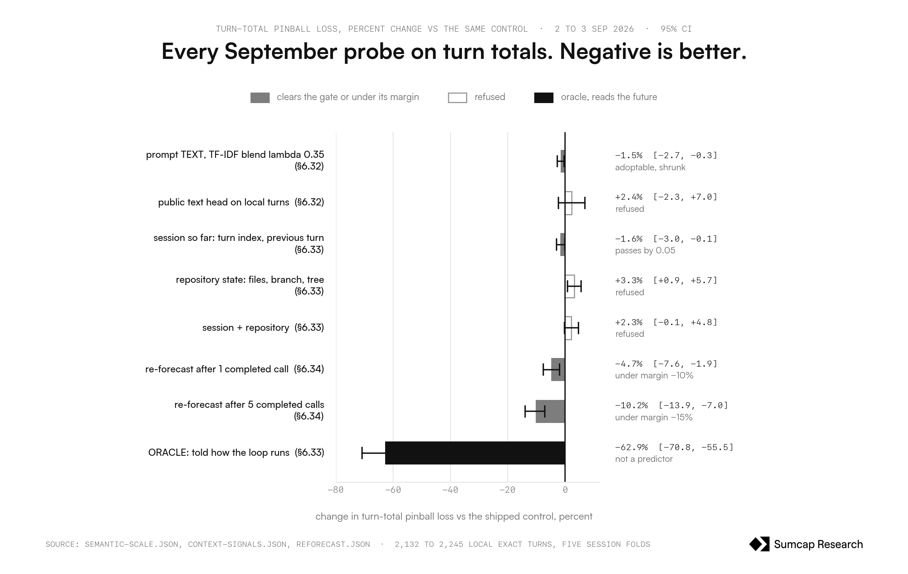

*Every September probe on turn totals, as percent change in pinball loss against the same control. 2 to 3 Sep 2026 · 2,132 to 2,245 exact turns · five session folds.*

The two turn-total candidates above carry the percent change against a 38-feature metadata control in the sklearn harness; both shrank further on the real gate. Prompt text on turn totals is worth about 1 percent. The best text stack (metadata plus TF-IDF; adding MiniLM changed nothing) won 10.6 percent on one split and pooled to +0.8 percent [-2.3, +4.3] over five session folds; nearest neighbours in embedding space were worse on the single split. Of the local-only text models, only a shrunk blend clears, at -1.5 percent [-2.7, -0.3] (2 Sep 2026 re-run, 2,164 turns, 1,805 with text). Repository state on turn totals: +3.3 percent [+0.9, +5.7], worse, and it memorizes projects (3 Sep 2026).

## Privacy and data flow

- Raw prompt and response text is not stored by default. Prompt text may be processed locally into derived numeric features (a file-path bit, an image bit, lexical counts); verified input counting sends the draft to Anthropic's count endpoint only when you enable it, with your own key.
- The daemon opens your history files under `~/.claude` and `~/.codex` read-only and never modifies them. It uploads nothing. Its API is loopback only, behind a bearer token in a file with mode 0600.
- The launchers watch the line you are editing inside a pty, reduce it to counts, and write those to a private file. They never write, log or send the text.
- The extension's default build makes no network requests. Two contribution options exist, diagnostics and forecast research, both off; a Delete button removes what you contributed.
- Telemetry tiers are `none`, `hash_only`, `redacted` and `full_opt_in`, enforced by the schema, the writer and the ingest handler. The default is `none`. Details in [docs/TELEMETRY.md](docs/TELEMETRY.md).
- Committed artifacts hold no prompt or response text: quantiles, counts, fitted trees and salted workload hashes.

## Build from source

There is no prebuilt download yet. Everything below builds from source. Calibrated forecasting ships for Claude Code; Codex ingestion is experimental and no bundled Codex calibration ships yet.

### macOS menu bar app

Needs macOS 14 or later on Apple silicon, Node.js 22 or later, and `python3` (from the Xcode Command Line Tools: `xcode-select --install`).

```sh
git clone https://github.com/Sumcap/token-forecaster.git
cd token-forecaster
pnpm install
cd apps/menubar && make dist
open .build/TokenForecaster.app
```

`make dist` also writes `.build/TokenForecaster.zip`. The app is ad-hoc signed, not notarized. On another machine run `xattr -dr com.apple.quarantine /Applications/TokenForecaster.app` or right-click the app and choose Open the first time.

### Windows daemon

Needs Windows 10 1809 or later, Node.js 22 or later, Python 3, and `pip install pywinpty` for the draft forecast. There is no menu bar app on Windows. The daemon's page at `http://127.0.0.1:<port>/dashboard` is the UI.

```powershell
git clone https://github.com/Sumcap/token-forecaster.git
cd token-forecaster
pnpm install
pnpm build
pnpm --filter @token-forecaster/companion build
node --no-warnings apps\companion\dist\cli.js index          # import history once, train, report
node --no-warnings apps\companion\dist\cli.js install-shell  # wrap claude and codex in your PowerShell profile
node --no-warnings apps\companion\dist\cli.js start          # foreground daemon
```

### Chrome extension

Run `pnpm build:extension`, open `chrome://extensions`, turn on Developer mode, and load `apps/extension/dist` unpacked. It shows on claude.ai/code by default; the chat surface is an opt-in toggle in its options and is labelled out of domain. The default build makes no network requests.

### Playground

`pnpm install && pnpm build && pnpm dev` opens it at `http://localhost:5199`. The verified input count needs `ANTHROPIC_API_KEY` in the environment or an `ant auth login` profile. Without either, the local estimate still shows.

## Using it

The app supervises a local daemon. The daemon indexes your Claude Code transcripts read-only, trains a personal profile from them, and serves a token-guarded API on `127.0.0.1`. A personal profile replaces the bundled one only if it cuts pinball loss by at least 2 percent on a 70/30 chronological split of your own calls. To put the forecast in the Claude Code status line, add this to `~/.claude/settings.json`:

```json
{"statusLine": {"type": "command", "refreshInterval": 2, "padding": 0,
  "command": "node --no-warnings /Applications/TokenForecaster.app/Contents/Resources/companion/statusline.js"}}
```

Run `tf-claude` instead of `claude` to see the estimate move while you type. The daemon writes that shell wrapper itself on first run and the app shows a notice once, with an Undo button. By hand: `node apps/companion/dist/cli.js install-shell`, and `uninstall-shell` restores the file byte for byte.

On Windows the status line setting is the same, pointing at `apps\\companion\\dist\\statusline.js` in your checkout with the backslashes doubled.

**The menu bar app's settings.** Show number in menu bar (adds the compact p50 next to the glyph), Detailed terminal status line (adds p50, p90 and the session total to the status line), Forecast from your draft (conditions the forecast on the prompt you are typing, when the CLI was launched with `tf-claude` or `tf-codex`), Wrap `claude` and `codex` in new terminals (on from the first run; switching it off is remembered), Launch at login, Pause or resume watching, Choose history directories, Restart daemon, Open log, Delete all derived data, Uninstall.

**Several sessions.** Every Claude Code session with the status line installed reports its own live turn. The daemon keeps one slot per session; the menu bar features the live one and moves on when it finishes.

**Uninstalling.** Settings › Uninstall Token Forecaster restores your shell startup file from the copy taken before the first edit, deletes the profile, the index and every setting, moves the app to the Trash and quits. Your Claude Code and Codex history is never touched; the app only reads it. By hand: `node apps/companion/dist/cli.js uninstall-shell`, then delete `~/Library/Application Support/TokenForecaster` and `~/Library/Logs/TokenForecaster`.

## Using the predictor as a library

```ts
import {
  BUNDLED_CLAUDE_CODE_PROFILE,
  historicalBaselineForecast,
  promptForecastFeatures,
  promptMentionsPath,
} from "@token-forecaster/predictor";

const { forecast, calibration } = historicalBaselineForecast(
  {
    model: "claude-opus-5",
    maxTokens: 16_000,                                  // your cap; quantiles are clamped to it, never derived from it
    thinkingEnabled: true,                              // omit only when you truly do not know
    promptMentionsPath: promptMentionsPath(turnPrompt), // a derived bit; the text is not kept
    boostedContext: {
      prompt: promptForecastFeatures(turnPrompt),       // lexical aggregates only
      agentLoop: {
        sessionPosition: 12,
        loopDepth: 3,
        priorCallCount: 3,
        priorMaxOutputTokens: 2_840,
        priorArtifactCount: 1,
        priorWriteObserved: true,
        priorArtifactObserved: true,
      },
    },
  },
  BUNDLED_CLAUDE_CODE_PROFILE,
);

forecast.p50; forecast.p90; forecast.p99;  // output tokens, clamped to maxTokens
forecast.confidence;                       // "low" or "medium"; "high" is never emitted today
forecast.source;                           // "trained" | "historical" | "default"
calibration.groupKey;                      // e.g. "model=claude-opus-5|thinking=yes"
calibration.sampleSize;                    // calls behind that group
calibration.usedFallback;                  // true on any pooled rung or the static guess
calibration.boostedCorrectionReason;       // "applied" | "profile_untrained" | "incomplete_context" | "unknown_thinking" | "fallback_group"
```

Four rules (12 Aug 2026 code):

1. Pass `thinkingEnabled` explicitly. Omitted means unknown: every thinking rung is skipped and the correction is not applied (`unknown_thinking`). It is never coerced to `false`, because on the shipped profile the no-thinking p99 is about 40 percent of the thinking p99 (3,309 against 8,313 tokens).
2. Surface `calibration.usedFallback`. When true, the numbers describe a pool of other models or the static guess, and `forecast.confidence` is `low`.
3. Unknown models never throw. Only malformed input does, such as an empty model, a `maxTokens` that is not a positive integer, or a bad `minSamples` option (default 100).
4. `forecast.confidence` is `medium` only when a model-specific group with at least 500 samples and the trained correction both apply. There is no `high`. `confidence` lives on `forecast`, not on `calibration`.

JSON callers: omit a key to mean unknown. Do not send `null`. The ladder reads `null` as unknown, but the correction's feature vector reads it as "no". Also exported: `historicalTurnTotalForecast` for the whole agent loop (returns `null` below 60 samples) and `historicalSessionTotalForecast`, unconditional by design.

## Limits and the next experiment

- One identifiable user behind every published number. Between users, calibration is unmeasured. On the author's own other projects, p90 coverage ranged from 80.9 to 95.4 percent, so loss transfers and calibration does not.
- The tool only watches. It never changes your request and never sets `max_tokens`; it only clamps its quantiles to the value you pass. It cannot save tokens or money on its own.
- Cap risk is unmeasurable. The corpus has zero calls cut off by `max_tokens`, and Claude Code transcripts do not record the cap.
- Turn and session totals rest on the least evidence: 1,182 turns and 346 sessions in the bundled profile. Treat them as rough.
- In the author's words, this is a calibrated reservation heuristic that knows its own ceiling, not a predictor of output length. Knowing in advance how long the agent loop will run would cut the error by 63 percent; nothing available before the call knows that.

Research preview. Contracts may change between releases. What ships today: the predictor library, the bundled single-user profile, the macOS app, the Windows daemon, the Claude Code status line, the launchers, the Chrome extension and the playground.

The next step, decided 4 Sep 2026 ([docs/PLAN-OF-ATTACK.md](docs/PLAN-OF-ATTACK.md)): multi-user telemetry, strictly opt-in and off by default; a weaker public base profile trained on public and pooled agent transcripts and post-trained on the installing user's machine; and a stranger gate (leave-user-out, pinball CI below zero, per-user p90 coverage between 85 and 95 percent) that a base must pass before it replaces the bundled profile. The daemon already post-trains locally, gated at a 2 percent margin.

## Reproduce, repository, cite

```sh
pnpm install && pnpm build && pnpm test      # workspace build and vitest across packages
pnpm evaluate:claude-history                 # regenerate the report, the profile and the bundled profile from your own ~/.claude/projects
pnpm dev                                     # playground on http://localhost:5199
```

Every chart in this README is generated from the JSON artifacts in `experiments/artifacts/` and the CSVs beside them. The numbered experiment ledger with a reproduce command per probe is [docs/STATE-OF-PLAY.md](docs/STATE-OF-PLAY.md); the outside reviewer's seven questions and their answers are in [docs/REVIEWER-ANSWERS.md](docs/REVIEWER-ANSWERS.md); every public corpus tried and why none could replace the local one is in [docs/CORPUS.md](docs/CORPUS.md); the plan for the next experiment is [docs/PLAN-OF-ATTACK.md](docs/PLAN-OF-ATTACK.md).

```text
apps/
  menubar/         macOS menu bar app (Swift); bundles the companion
  companion/       local daemon, status line, tf-claude and tf-codex launchers
  extension/       Chrome extension for claude.ai
  playground/      Vite + React playground with an Express count_tokens server
packages/
  core/            schemas, context-budget math, forecast interfaces
  predictor/       the ladder, the correction, the bundled profile
  personal/        fit, evaluate and gate your own profile
  ingest-claude/   read ~/.claude/projects transcripts
  ingest-codex/    read ~/.codex/sessions transcripts
  anthropic/       count endpoint adapter, server-side only
  model-registry/  Claude model ids, context and output limits, pricing
  token-counter/   local estimate, debounce, reconciliation with verified counts
  telemetry/       privacy-aware JSONL logging
experiments/       every probe, its gate and its JSON artifact
docs/              experiment ledger, reviewer answers, plans and ADRs; index in docs/README.md
```

MIT. Copyright (c) 2026 Sumcap Research.

```text
Sumcap Research (2026). Token Forecaster: output-length forecasting for Claude,
measured from Claude Code transcripts. Bundled profile claude-code-local-2026-08-12.
https://github.com/Sumcap/token-forecaster
```

## Credits

- Idea and initial coding by [Eduardo Nunes](https://x.com/polpedu) (Sumcap Research). The bundled profile is fitted on his own Claude Code history.
- Write-up, figures and launch: Sumcap Research.
- Anthropic: the Claude Code status line hook and the `count_tokens` endpoint.
- OpenAI: Codex session logs, read by the experimental `ingest-codex` package.
- Length prediction: [arXiv:2604.07931](https://arxiv.org/abs/2604.07931), [arXiv:2604.00499](https://arxiv.org/abs/2604.00499), S3 ([arXiv:2306.06000](https://arxiv.org/abs/2306.06000)), Response Length Perception ([arXiv:2305.13144](https://arxiv.org/abs/2305.13144)), hidden-state probes ([arXiv:2602.11812](https://arxiv.org/abs/2602.11812), [arXiv:2607.05316](https://arxiv.org/abs/2607.05316)).
- Calibration: Koenker and Bassett (1978); Vovk, Gammerman and Shafer (2005); [Angelopoulos and Bates](https://arxiv.org/abs/2107.07511); [Romano, Patras and Candès](https://arxiv.org/abs/1905.03222). Notes in [research/literature-review.md](research/literature-review.md).
- Tooling: TypeScript, Node, pnpm, zod, esbuild, vitest, Vite, React, Express; the menu bar app is Swift.
