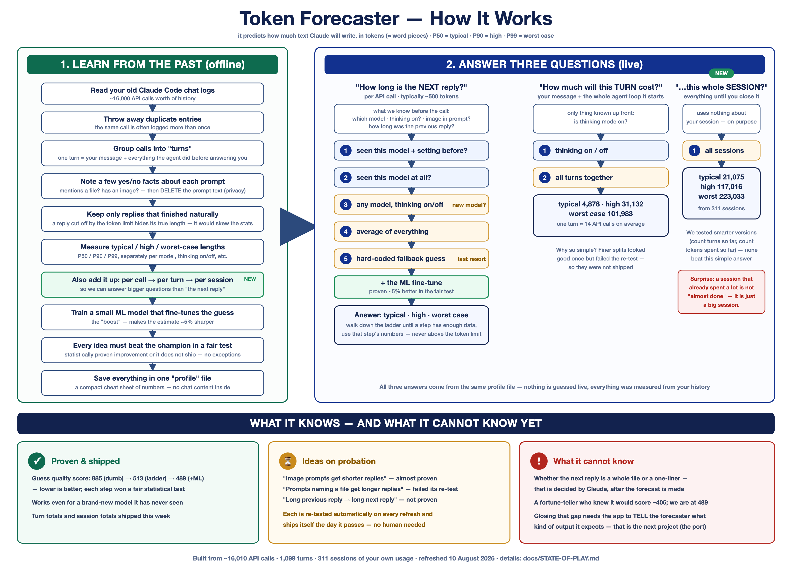
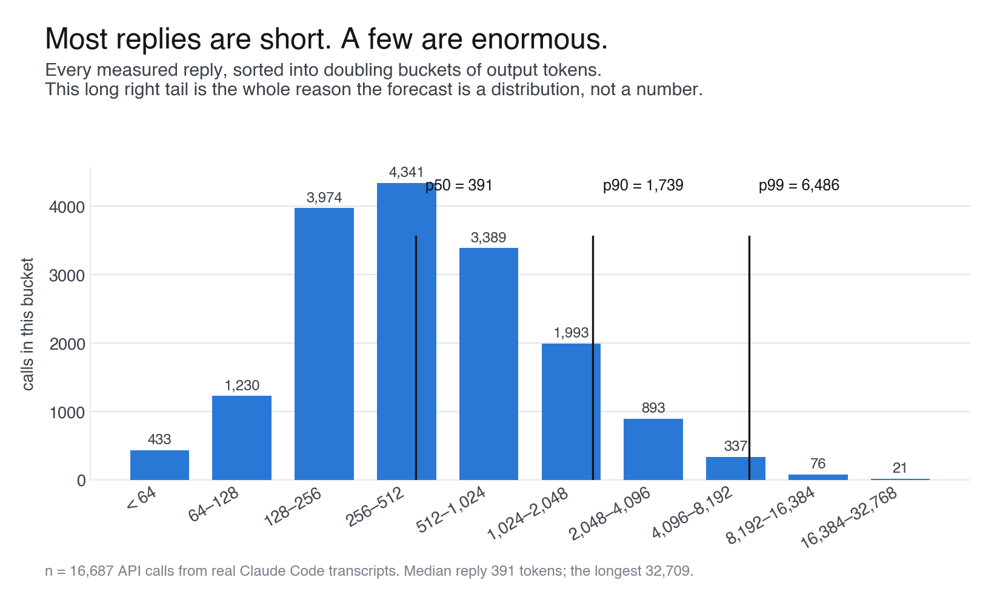
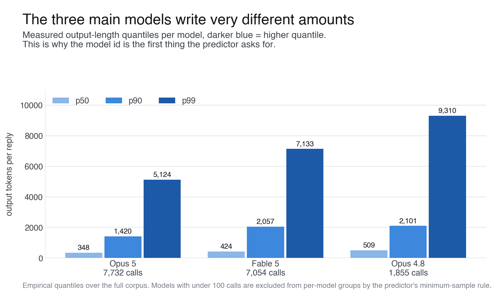
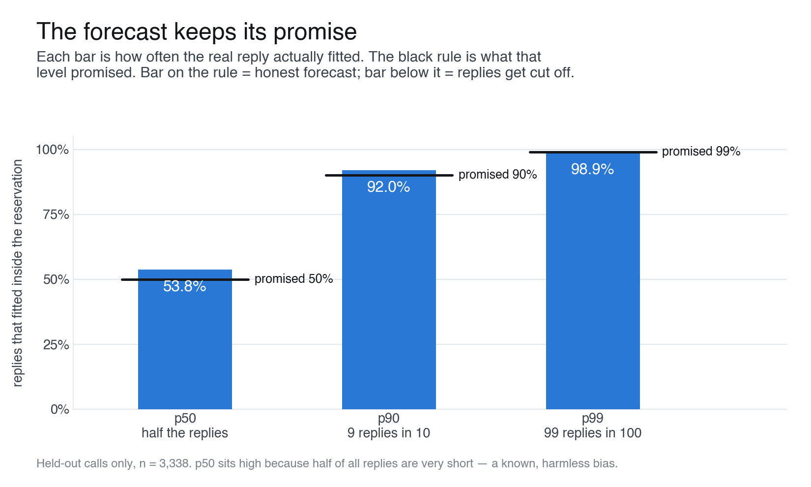
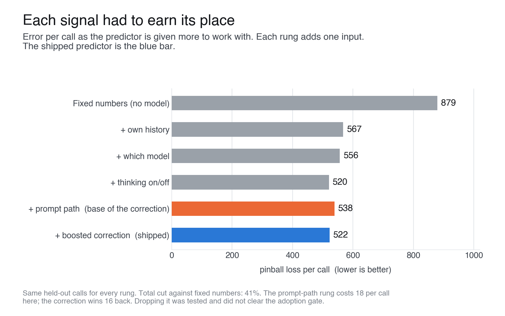
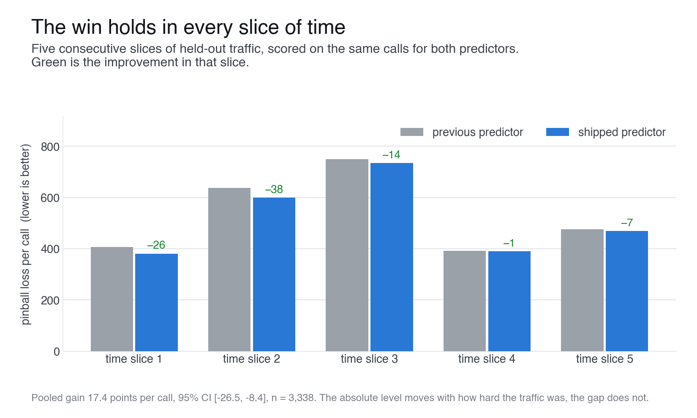
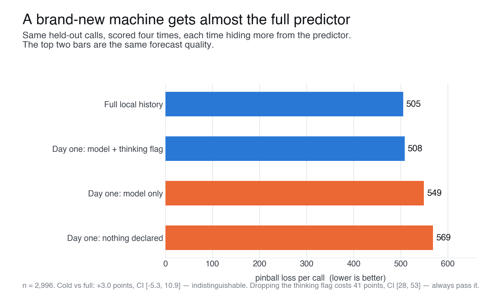

# Token Forecaster

> **Note:** Token Forecaster currently works with Anthropic models only
> (Claude). Support for all models is planned.

Token Forecaster answers a simple question before you send a Claude request:
how many output tokens is the reply likely to use? It counts your input with
Anthropic's own counting endpoint, and it forecasts the output length from
around 16,000 real API calls measured in actual Claude Code sessions.

Nothing here is a guess typed into a constant. Every number the forecaster
ships was measured, tested against a held-out slice of history, and forced to
beat the previous version in a statistical test before it was allowed in.



## What you get

While you compose a request, the playground shows something like this:

```text
Model                 Claude Opus 5        extended thinking: on
Input                 18,420 tokens        Anthropic counted
Context usage         18,420 / 1,000,000   1.84%
Reserved output       16,000 tokens
Forecast output       p50: ~500 · p90: ~1,870 · p99: ~6,510
Projected total       p50: ~18,920 · p90: ~20,290
Context after p90     ~979,710 tokens
Estimated cost        $0.0617 to $0.0843
```

The two halves of that panel are different problems, and the project treats
them differently:

- **Input tokens are a counting problem.** Anthropic exposes an official
  endpoint that counts a request the same way the API will bill it. We use
  that as the source of truth, with a fast local estimate to keep the UI
  responsive while you type. Every number is labelled with where it came from.
- **Output tokens are a prediction problem.** Nobody can know the exact length
  of a reply before it exists. So the forecast is a distribution, not a
  number: a median (p50), a likely upper bound (p90), and an extreme bound
  (p99), plus a confidence label.

## The data

The whole predictor is built from real usage: 471 Claude Code transcript
files, 16,011 unique API calls after deduplication, zero calls cut off by the
token limit. Those files come from one person's `~/.claude`: the corpus
contains many calls, but only one identifiable user. Read every number below
as a prior for this kind of work, not as a calibration of how you write. What
that costs, and the plan to retire it, is in
[docs/MULTI-USER-PLAN.md](docs/MULTI-USER-PLAN.md). This is what those replies
actually look like:



Half of all replies are under 400 tokens. One in a hundred is over 6,600. That
long tail is why a single point estimate would be useless: any number small
enough to be a good typical guess would be overrun badly several times per
session.

The model you call matters a lot, which is why it is the first input the
predictor asks for:



The workload also drifts over time. Replies got about a third shorter over
July, which is why the profile is regenerated from a rolling window instead of
fitted once and frozen:


## How the forecast is made

The short version: look up what happened the last few thousand times a request
looked like this one, take the quantiles of those lengths, then let a small
trained correction nudge them using what the current agent session already
knows. Here is one real call walked through top to bottom:


And here is the same pipeline with the actual mechanics, including the part
that never ships: the evaluation loop that decides whether a new predictor is
allowed to replace the current one.


A few design choices worth calling out:

- **A ladder, not a model soup.** The predictor walks down a ladder of
  historical groups, from very specific (model + thinking + effort + task) to
  very broad (all calls pooled), and uses the first rung with at least 100
  samples. A request it has never seen still gets a sane answer.
- **The p90 is the number that matters.** Reserving too much room wastes a
  little context. Reserving too little cuts a reply off mid-file. The loss
  function prices a token of shortfall nine times higher than a token of
  slack, so the forecast leans safe on purpose.
- **Truncated replies never poison the stats.** A reply cut off by the token
  limit hides its true length, so it is excluded from the quantiles entirely.

## Does it actually work

Calibration is the honest test: a p90 forecast is only worth something if
about 90 percent of real replies actually fit under it. On held-out calls the
predictor never trained on, they do:



Each input the predictor uses had to earn its place. Starting from fixed
numbers with no model at all, every added signal cuts the error, and the full
shipped predictor cuts it 45 percent:



The improvement is not a lucky split. Scored across five consecutive slices of
held-out traffic, the shipped predictor wins in every one:



### Cold start is a first-class case

A fresh install with zero local history is not a degraded mode. A caller that
passes only the model id and the thinking flag lands within noise of the full
predictor. Dropping the thinking flag is what actually hurts:



Even a model the profile has never seen gets a useful answer. Pooled
thinking-conditioned groups replaced the old blended fallback after beating it
by 43 points per call in a leave-one-model-out test:


### Nothing ships without beating the champion

Every candidate improvement is scored against the current predictor on the
same held-out calls, with a session-bootstrap confidence interval. The whole
interval has to sit below zero. Most ideas do not make it, and the rejections
are kept on record so they are not retried by accident:


Some intuitive ideas that failed this gate: input size (made the tail worse),
tool count (no signal), the recorded effort level (its apparent 4.6x effect
disappears once you hold date and model fixed), and prompt-mentions-a-file
(failed its re-test on the latest corpus, re-tested automatically on every
refresh). The details live in [docs/STATE-OF-PLAY.md](docs/STATE-OF-PLAY.md)
and [docs/GENERATIVE-MODEL.md](docs/GENERATIVE-MODEL.md).

## Using the predictor

```ts
import {
  BUNDLED_CLAUDE_CODE_PROFILE,
  historicalBaselineForecast,
  promptForecastFeatures,
  promptMentionsPath,
} from "@token-forecaster/predictor";

const { forecast, calibration } = historicalBaselineForecast(
  {
    model: "claude-opus-5",   // required
    maxTokens: 16_000,        // required
    thinkingEnabled: true,    // optional, but always pass it when you know it
    promptMentionsPath: promptMentionsPath(turnPrompt),
    boostedContext: {
      prompt: promptForecastFeatures(turnPrompt),
      agentLoop: {
        sessionPosition: 12,
        loopDepth: 3,
        priorCallCount: 3,
        priorMaxOutputTokens: 2_840,
        priorArtifactCount: 1,
        priorWriteObserved: true,
        priorArtifactObserved: true,
      },
    },
  },
  BUNDLED_CLAUDE_CODE_PROFILE,
);
```

Three rules save most integration mistakes:

1. **Optional flags are tri-state.** Omitting `thinkingEnabled` means unknown,
   not false. The no-thinking groups have about a third of the p99 of the
   thinking groups, so coercing unknown to false would under-forecast a
   thinking request by roughly 3x at the tail. The same logic applies to
   `promptMentionsPath` and `previousOutputTokens`: pass a value when you
   observed one, omit the field when you did not.
2. **There is no silent degradation.** If the profile does not know your
   model, `calibration.usedFallback` is `true` and confidence is `low`. Treat
   that forecast as a rough reservation hint and say so in your UI.
3. **Unknown models never throw.** The function only throws on malformed
   input, such as an empty model string or a non-positive `maxTokens`.
4. **The profile is a single-user prior, and it says so.**
   `calibration.profileId` and `calibration.profileScope` name a corpus fitted
   on one person's history. Do not read the id to work that out: the profile
   carries an optional `provenance` field, and the bundled profile sets it to
   `"single-user-corpus"`. Surface that wherever you surface the numbers. An
   absent `provenance` means the profile predates the field, so treat it as
   unknown rather than as a multi-user claim.

The full field-by-field contract, including exactly which groups the current
bundled profile ships and which gated features are waiting for their re-test
to pass, is in [docs/STATE-OF-PLAY.md](docs/STATE-OF-PLAY.md).

## Privacy

The tool is also the instrument that collects its own training data, so
privacy is a default, not an option:

- Raw prompt text is never stored by default. The default mode records a
  prompt hash, derived numeric features, token counts, request configuration,
  the forecast, and the actual usage.
- API keys stay server-side. The browser never sees them.
- This repository does not deploy a hosted backend. Direct-API observations are
  append-only local JSONL files that you own. The Chrome extension now has two
  separate, off-by-default contribution choices and a build-configurable
  anonymous collector with schema-only batching and deletion; browser outcomes
  are explicitly marked as DOM estimates. [docs/TELEMETRY.md](docs/TELEMETRY.md)
  covers encrypted deployment and the exact separation rules.

## Repository layout

```text
token-forecaster/
├── apps/
│   ├── menubar/           macOS menu bar app (Swift); bundles the companion
│   ├── companion/         Local daemon, status line, `tf-claude`/`tf-codex`
│   ├── extension/         Chrome extension for claude.ai
│   └── playground/        Vite + React playground; Express count_tokens server
├── packages/
│   ├── core/              Zod schemas, context-budget math, warning logic
│   ├── anthropic/         Server-side adapter: count_tokens, streaming, usage
│   ├── model-registry/    Versioned model limits and pricing with provenance
│   ├── token-counter/     Local estimator, debounce, race-safe reconciliation
│   ├── predictor/         Historical ladder + trained quantile correction
│   ├── telemetry/         Privacy-aware JSONL observation logging
│   ├── react/             Hooks and components (Phase 6)
│   ├── personal/          Local training: fit, evaluate, and gate your profile
│   ├── ingest-claude/     Read ~/.claude/projects transcripts
│   ├── ingest-codex/      Read ~/.codex/sessions transcripts
│   └── cli/               Planned; not implemented yet
├── experiments/           Probes, evaluation scripts, generated artifacts
├── research/              Competitive analysis, literature review, ADRs
├── fixtures/              Race-condition fixtures for count reconciliation
└── docs/                  Reports, state of play, backlog, chart sources
```

## Install on macOS

The menu bar app is the thing to install. It runs a local daemon that reads your
own Claude Code and Codex transcripts, trains a forecaster on them, and puts a
live estimate in your terminal status line — in Claude Code, which runs it as
its status line, and in Codex, which has no such hook, so the launcher reserves
the bottom row of the terminal and paints it there. Nothing leaves the machine.

**Requirements:** macOS 14+, Apple silicon, Node.js 22+ (`brew install node`),
and `python3` — the `claude` and `codex` launchers are Python scripts, and Xcode
Command Line Tools provide it (`xcode-select --install`).

```sh
git clone https://github.com/polpedu-crypto/token-forecaster.git
cd token-forecaster
pnpm install
cd apps/menubar && make dist
open .build/TokenForecaster.app
```

`make dist` also writes `.build/TokenForecaster.zip`, which is what you send to
someone else. It is ad-hoc signed rather than notarized, so on the receiving
machine Gatekeeper needs one of:

```sh
xattr -dr com.apple.quarantine /Applications/TokenForecaster.app
```

or a right-click → **Open** the first time. Full walkthrough, including the
terminal status line and the `claude` and `codex` launchers, is in
[apps/menubar/README.md](apps/menubar/README.md); the daemon and its API are
documented in [apps/companion/README.md](apps/companion/README.md).

## Install on Windows

There is no menu bar app — that one is Swift and stays on macOS. Everything that
produces a forecast runs on Windows: the daemon, the terminal status line, and
the draft-aware `claude` and `codex` launchers, which open a pseudo console
(ConPTY) where the Mac opens a pty. The dashboard the daemon serves on loopback is the UI in
the menu bar's place.

**Requirements:** Windows 10 1809+ (ConPTY), Node.js 22+, Python 3, and
`pip install pywinpty`. Without pywinpty the draft forecast is the only thing
that stops working, and it says so once rather than failing quietly.

```powershell
git clone https://github.com/polpedu-crypto/token-forecaster.git
cd token-forecaster
pnpm install
pnpm build
pnpm --filter @token-forecaster/companion build

node --no-warnings apps\companion\dist\cli.js index
node --no-warnings apps\companion\dist\cli.js install-shell   # then: . $PROFILE
node --no-warnings apps\companion\dist\cli.js start
```

`install-shell` writes a `claude` and a `codex` function into your PowerShell
profile, backing the profile up first and restoring it byte for byte on
`uninstall-shell`. The
status line, the Startup-folder recipe for running the daemon after a reboot,
and where state is kept (`%LOCALAPPDATA%\TokenForecaster`) are all in
[apps/companion/README.md](apps/companion/README.md).

## Getting started

```sh
pnpm install
pnpm build          # build workspace packages (the server imports built output)
pnpm test           # vitest across packages

# Regenerate the report, the JSON profile, and the bundled profile:
pnpm evaluate:claude-history

# Start the count_tokens server and the UI on http://localhost:5199.
# Provider verification needs ANTHROPIC_API_KEY or an `ant auth login` profile.
pnpm dev
```

Type into the playground and the count updates instantly from a labelled local
estimate, then flips to the provider-counted number after a debounce. Stale
verification responses can never overwrite newer counts.

All the charts in this README are generated from the JSON artifacts in
`experiments/artifacts/` by the scripts in `docs/report-assets/`, so they
regenerate together with the data.

## Where things stand

Phase 1 and 2 foundations are done, plus the adopted Baseline 3 predictor:
schemas, model registry, context-budget engine, race-safe counting, the
hierarchical quantile ladder, the trained correction, chronological and
rolling evaluation, privacy-safe telemetry, and the playground. Cap-risk
estimation stays unavailable until telemetry collects calls where the token
limit actually binds; the corpus so far contains none. The running record of
what was tried, adopted, refused, and why is
[docs/STATE-OF-PLAY.md](docs/STATE-OF-PLAY.md).
