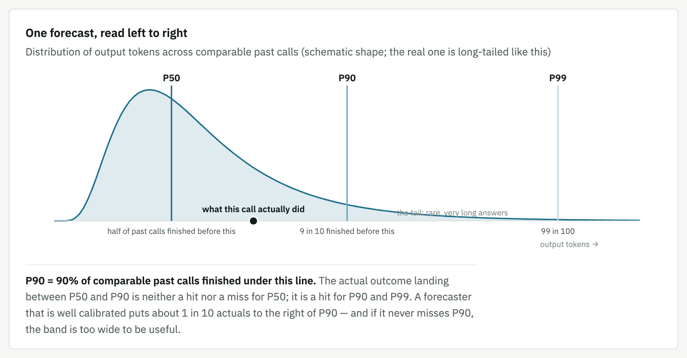
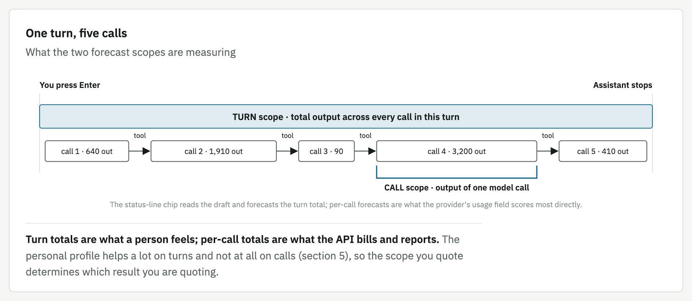
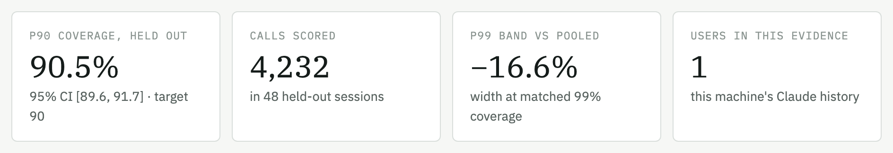
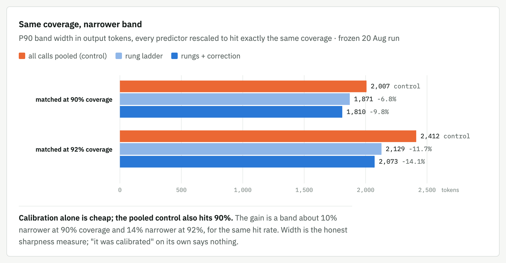
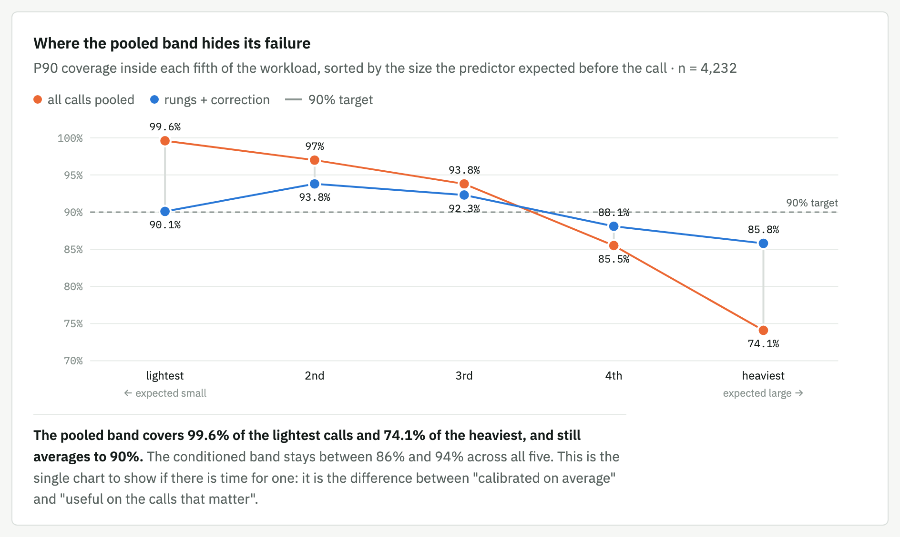
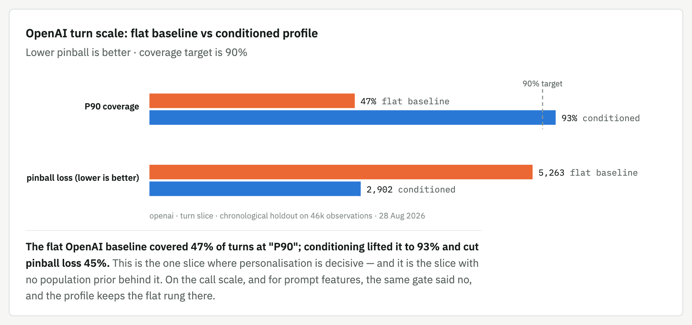
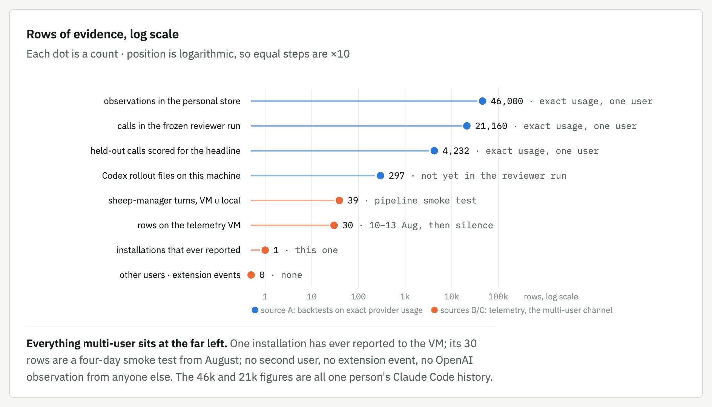
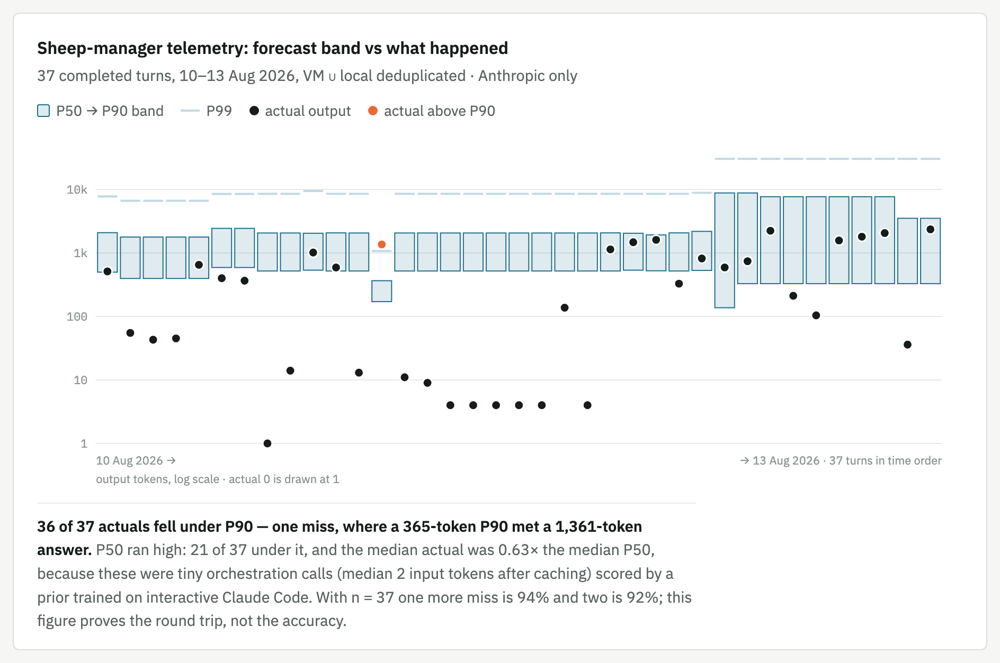

# Token Forecaster: what it does, and how much to trust it

**Prepared:** 1 September 2026  
**Companion to:** [`OPENAI-SWE-MEETING-BRIEF.md`](OPENAI-SWE-MEETING-BRIEF.md)

The short version of the brief: ten figures, one claim each, for putting on screen or reading in five minutes. The brief carries the full argument (weaknesses, improvement order, the 13 questions, meeting flow) and embeds most of these same figures where the text makes the claim. Every number here is the same number as in the brief. The last two figures use data pulled from the telemetry VM and the local sheep-manager store on 1 September 2026.

Everything is one user, one machine; `n` is printed on every chart. Images live in [`report-assets/meeting-brief/`](report-assets/meeting-brief/) and were rendered from the same SVG source as the interactive page.

---

## 1. The three numbers are quantiles of history

Before a call runs, the forecaster looks at past calls that resemble it and reports where 50%, 90% and 99% of them finished. It does not predict *this* call. It says how wide the plausible range has been for calls like it.

**Why it matters:** this is the picture that stops "P90 means 90% confidence" from ever being said. An actual landing between P50 and P90 is a miss for P50 and a hit for P90 and P99, and that is the expected outcome about 40% of the time. A forecaster that never misses P90 is not good; its band is too wide to be useful.

## 2. Two loops: a live one and a learning one

The live loop turns keystrokes into a number on the status line in well under a second. The learning loop runs after calls finish, reads the provider's own `usage` fields, and only changes what the live loop serves after passing a chronological test.

**Why it matters:** nothing reaches the status line unless it has beaten the current profile on data strictly later than what it was trained on. The VM is a side branch off the store: it receives forecast/actual pairs and nothing else, and today it is not load-bearing for any forecast. The bundled prior at the bottom of the predictor box is one person's Claude Code history, and it is the fallback for every user who has not trained a profile, including every OpenAI user.

## 3. A call is not a turn

Codex and Claude Code both run several model calls for one human prompt: the model reads, calls a tool, reads the result, calls again. The forecaster scores both scales separately, and the evidence differs sharply between them.

**Why it matters:** turn totals are what a person feels; per-call totals are what the API bills and reports. The personal profile helps a lot on turns and not at all on calls (section 5), so the scope you quote determines which result you are quoting.

## 4. The headline result, and the picture behind it

Frozen run of 20 August 2026: 21,160 Claude Code calls in 402 sessions, with 4,232 calls in 48 whole sessions held out. Sessions are held out whole, so no call is ever scored by a model that saw its neighbours.

**Why it matters:** calibration alone is cheap; the pooled control also hits 90%. The gain is a band about 10% narrower at 90% coverage and 14% narrower at 92%, for the same hit rate. Width is the honest sharpness measure; "it was calibrated" on its own says nothing.

**Why it matters:** the pooled band covers 99.6% of the lightest calls and 74.1% of the heaviest, and still averages to 90%. The conditioned band stays between 86% and 94% across all five. If there is time for only one chart in the meeting, it is this one: it is the difference between "calibrated on average" and "useful on the calls that matter".

## 5. Personalisation matters most exactly where OpenAI needs it

Chronological holdout on this machine's 46k observations, 28 August 2026. The user's own flat distribution is the baseline; conditioning on model and reasoning effort is the candidate. Each provider × scale slice decides on its own.

**Why it matters:** the flat OpenAI baseline covered 47% of turns at "P90"; conditioning lifted it to 93% and cut pinball loss 45%. This is the one slice where personalisation is decisive, and it is the slice with no population prior behind it. On the call scale, and for prompt features, the same gate said no, and the profile keeps the flat rung there. The draft-aware bar the user sees on this machine is a deliberate override of a gate that failed by a hair (+0.5% worse on the mean including P99), and the brief says so.

## 6. How much evidence there is, by source

Three sources, kept apart. The first carries statistical weight. The other two prove the plumbing works end to end and show how little multi-user data exists.

**Why it matters:** everything multi-user sits at the far left. One installation has ever reported to the VM; its 30 rows are a four-day smoke test from August; no second user, no extension event, no OpenAI observation from anyone else. The 46k and 21k figures are all one person's Claude Code history.

**Why it matters:** 36 of 37 actuals fell under P90; the one miss is a 365-token P90 meeting a 1,361-token answer. P50 ran high (21 of 37 under it; median actual 0.63× the median P50) because these were tiny orchestration calls scored by a prior trained on interactive Claude Code. With n = 37 one more miss is 94% and two is 92%; this figure proves the round trip, not the accuracy.

One thing this chart shows that the table does not: the last ten columns have P90s of 7,678–8,798 and P99s of 30,313 against P90s of about 2,000 before. The predictor version changed on 12 August (`claude-code-local-2026-08-12`) and the band roughly quadrupled for the same kind of call. That is a retraining swing on tiny n, and a fair example of why the adoption gate exists.

## 7. The honest answer in one paragraph

Well validated for one user's Claude Code history at both scales: 90.5% P90 coverage on held-out sessions with a tight interval, bands 10–17% narrower than the naive control at matched coverage, coverage that holds above 85% even in the heaviest fifth of calls. Personalisation is proven to matter most where the OpenAI story needs it: the flat OpenAI turn baseline covers 47%, conditioning lifts it to 93%. Everything multi-user is at n = 1: 30 rows from one smoke test, no second installation, and the OpenAI forecast for any other user is a labelled static prior. The engineering is reliable; the population evidence does not exist yet.

**Do not say:** "It predicts how many tokens this request will use." · "P90 means 90% confidence." · "It has been validated across users." · "The VM shows it working for other users." · "Output tokens are Codex subscription usage."

**Say instead:** "It reports historical conditional quantiles, labels the fallback it used, and has been checked on one user's exact provider usage with sessions held out whole. The multi-user evidence is the part that does not exist yet, and that is what I want to talk about."

---

## Where the numbers come from

| Figure | Source |
|---|---|
| 1–3 | Schematic; mechanism as built in `apps/companion`, `packages/personal`, `packages/ingest-claude` |
| 4 (tiles, band width, per-fifth coverage) | `REVIEWER-ANSWERS.md`, frozen run 20 Aug 2026 13:50 UTC; do not re-run before the post goes out |
| 5 | Personal-profile chronological evaluator, 28 Aug 2026, recorded in `adr/0001-macos-companion.md` and `BACKLOG.md` |
| 6 (volume) | Counts taken 1 Sep 2026: `~/.claude/projects`, `~/.codex/sessions`, the VM's `/var/lib/token-forecaster/*.jsonl`, `sheep-manager/data/telemetry/observations.jsonl` |
| 6 (telemetry rows) | VM ∪ local `observations.jsonl`, deduplicated by `id`, forecast-only rows excluded |
