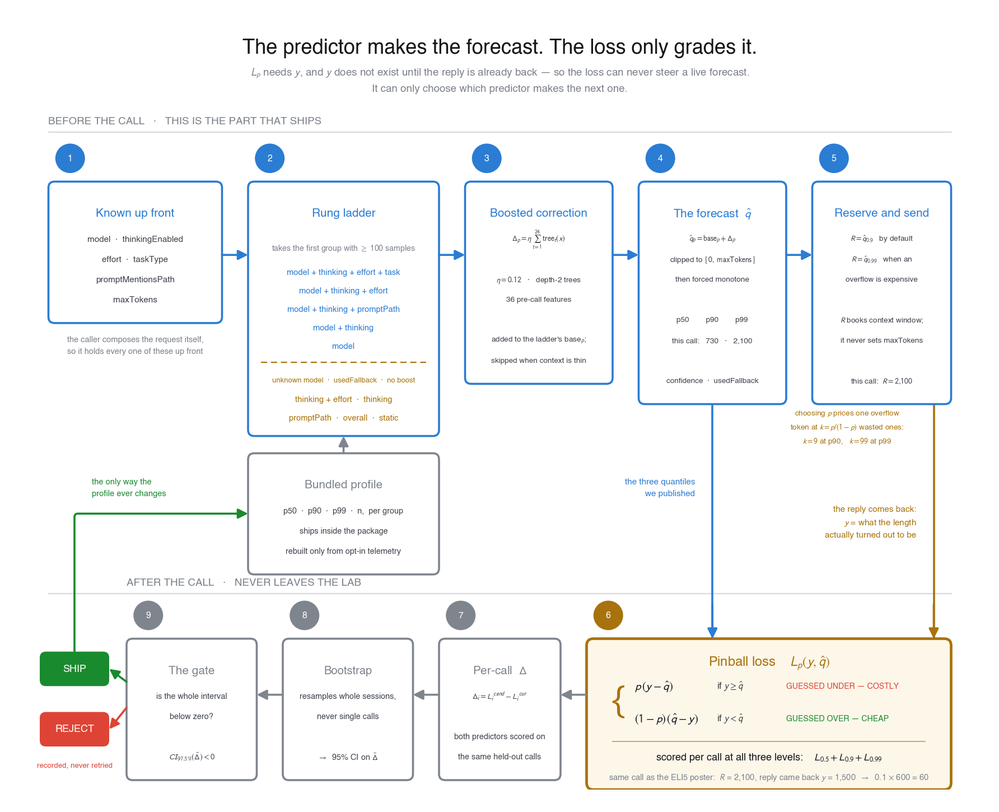
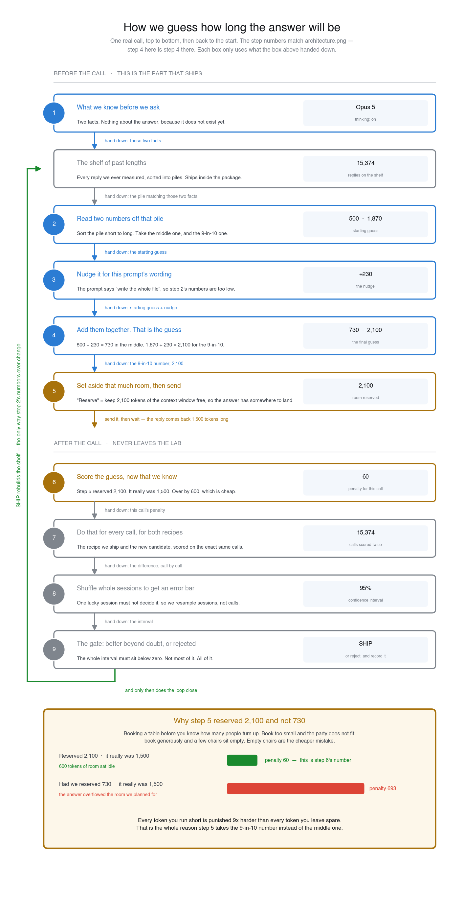
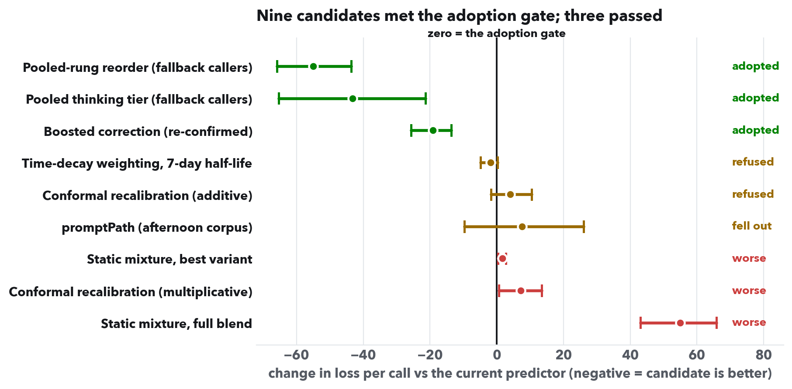
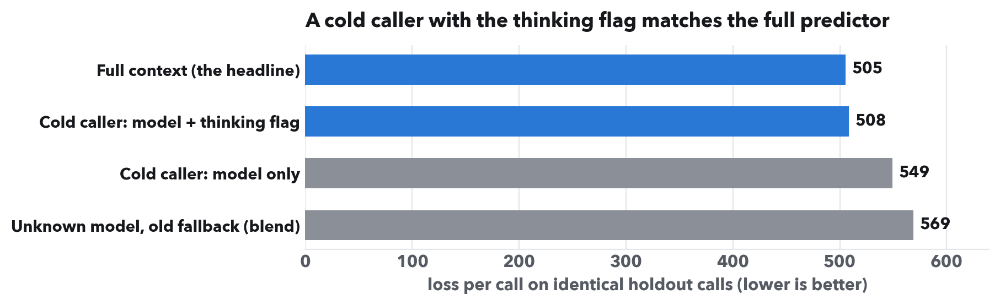
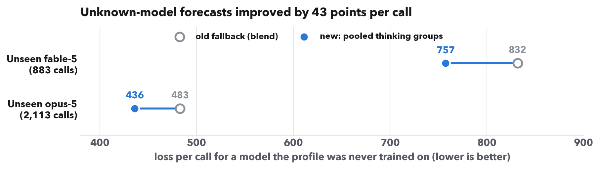
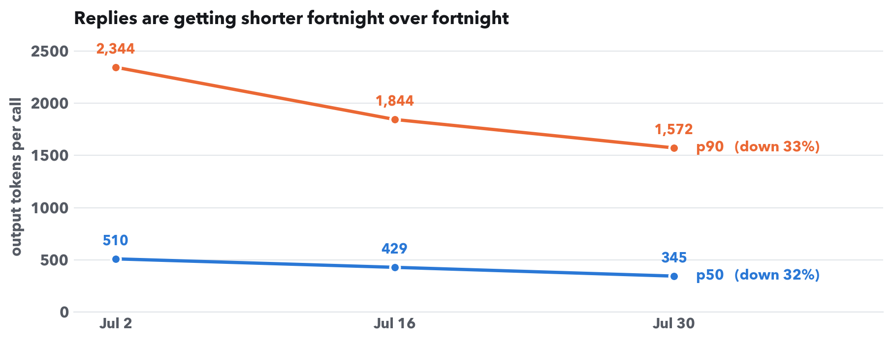

# The Cold-Start Audit

*Token Forecaster — 9 August 2026. Companion to [STATE-OF-PLAY.md](./STATE-OF-PLAY.md) §6.18–§6.22.*

---

## The 30-second summary

The predictor answers one question before a Claude call is sent: **how many output tokens should I reserve?** This session audited the version of that question the product actually depends on: what happens when the predictor knows almost nothing about the caller.

Four results:

1. **One real improvement shipped.** Callers using a model the profile has never seen now get a far better forecast — 43 points per call better, about 8% on that path. The fix had been sitting unused in the code since June.
2. **One mystery solved.** We now know why the forecasts run slightly high: the workload itself is shrinking week over week.
3. **Four dead ends closed permanently**, each with a number attached, so no future session re-tries them.
4. **One feature un-adopted itself.** The prompt-path signal fell back out of the profile when its own gate re-ran. That is the system working as designed.

---

## Background: what this project does

Before you send a request to Claude, you need to leave room in the context window for the reply. But nobody can know the reply's exact length $Y$ in advance. So instead of one guess, the predictor gives a range, as three quantiles $\hat{q}_p$:

| Number | Meaning |
|---|---|
| $\hat{q}_{0.50}$ (p50) | half the time, the reply is shorter than this: $P(Y \le \hat{q}_{0.50}) \approx 0.5$ |
| $\hat{q}_{0.90}$ (p90) | 9 times out of 10, shorter than this: $P(Y \le \hat{q}_{0.90}) \approx 0.9$ |
| $\hat{q}_{0.99}$ (p99) | 99 times out of 100, shorter than this: $P(Y \le \hat{q}_{0.99}) \approx 0.99$ |

You reserve space using the p90 (or the p99 when getting cut off would be expensive). Reserving too little truncates the reply; reserving too much wastes context you could have used.

Here is the whole system in one picture. Steps ①–⑤ in blue are the predictor: the part that ships inside the consumer app and runs before every single call. Steps ⑥–⑨ in grey are the grading loop, which runs only here in the lab. The two rules stated below this diagram govern the amber box ⑥ and the gate ⑨.



The most important thing in that picture is the arrow that *isn't* there: nothing runs from the amber box back into the blue lane. $L_p$ needs $y$, and $y$ does not exist until the reply is already back — so the loss can never steer a live forecast. The only path back is the green one, and it moves at the speed of releases, not calls.

The same nine steps again, without notation, following one concrete call from "we know two facts" to "was that guess any good". Step *n* below is step *n* above, and the worked numbers — a 2,100-token reservation against a reply that turned out to be 1,500 — are the same call in both pictures. It is the version to hand to someone who has to *use* the forecast rather than change it.



Note what the plain-language version makes explicit that the technical one leaves implicit: "reserve" means setting aside context window, and nothing more. The forecast never sets `max_tokens` — that arrives as a caller-supplied input in box ①, and the predictor only uses it to clamp its own output. A forecaster that capped the model would truncate the replies it needs to learn from, and those truncated rows are censored and dropped, so the corpus would lose exactly the long tail it is trying to measure.

Two rules govern everything in this repo:

- **The score** is pinball loss — a penalty for wrong guesses that is deliberately much harsher when the guess is too low:

$$L_p(y, \hat{q}) = \begin{cases} p \cdot (y - \hat{q}) & \text{if } y \ge \hat{q} \quad \text{(guessed too low — expensive)} \\[4pt] (1-p) \cdot (\hat{q} - y) & \text{if } y < \hat{q} \quad \text{(guessed too high — cheap)} \end{cases}$$

  Here $y$ is what actually happened — the reply's true length in output tokens, known only after the call — $\hat{q}$ is the forecast we published before the call, and $p$ is which promise that forecast was making: $p = 0.5$ for the p50, $0.9$ for the p90, $0.99$ for the p99. The gap $|y - \hat{q}|$ is the same in either branch; only the multiplier changes. For the p90 that means guessing under costs $0.9\times$ the gap while guessing over costs only $0.1\times$ — and that lopsidedness is exactly what makes the best possible $\hat{q}$ equal the true 90th percentile. We report the sum over the three levels, $L_{0.5} + L_{0.9} + L_{0.99}$, per call. Lower is better. A "point" in this report is just a token: the loss inherits the units of $y$.

- **The shipping rule**: a change ships only if it beats the current predictor on held-out data, judged by a paired session-block bootstrap on the per-call difference $\Delta_i = L_i^{\text{candidate}} - L_i^{\text{current}}$. Adoption requires the entire 95% confidence interval below zero: $\mathrm{CI}_{97.5\%}(\bar{\Delta}) < 0$ — that is, even the *upper* end of the interval, the most pessimistic reading of the evidence, must still be an improvement. A better-looking average is not enough.

### The two rules, worked through

**Rule one, on a single call.** Before sending, the predictor publishes three numbers: $\hat{q}_{0.50} = 300$, $\hat{q}_{0.90} = 1{,}200$, $\hat{q}_{0.99} = 3{,}000$. Then the reply arrives, and what we owe depends entirely on where its true length lands.

*Case A — a typical short reply, $y = 400$.*

| level | $\hat{q}$ | verdict | cost |
|---|---|---|---|
| p50 | 300 | under by 100 | $0.5 \times 100 = 50$ |
| p90 | 1,200 | over by 800 | $0.1 \times 800 = 80$ |
| p99 | 3,000 | over by 2,600 | $0.01 \times 2{,}600 = 26$ |
| | | **total** | **156** |

*Case B — a long reply that beat the p90, $y = 1{,}500$.*

| level | $\hat{q}$ | verdict | cost |
|---|---|---|---|
| p50 | 300 | under by 1,200 | $0.5 \times 1{,}200 = 600$ |
| p90 | 1,200 | under by 300 | $0.9 \times 300 = 270$ |
| p99 | 3,000 | over by 1,500 | $0.01 \times 1{,}500 = 15$ |
| | | **total** | **885** |

*Case C — an unusually long reply, $y = 2{,}600$.*

| level | $\hat{q}$ | verdict | cost |
|---|---|---|---|
| p50 | 300 | under by 2,300 | $0.5 \times 2{,}300 = 1{,}150$ |
| p90 | 1,200 | under by 1,400 | $0.9 \times 1{,}400 = 1{,}260$ |
| p99 | 3,000 | over by 400 | $0.01 \times 400 = 4$ |
| | | **total** | **2,414** |

Look at the two extremes side by side. In Case A we overshot the p99 by a full 2,600 tokens and it cost 26 points. In Case C we undershot the p90 by 1,400 tokens and it cost 1,260. Per token of error, being short costs $9\times$ more than being long at the p90, and $99\times$ more at the p99. That is the metric encoding the product's actual asymmetry: wasted reservation is annoying, a truncated reply is a broken call.

**Why the honest forecast is the cheapest one.** Suppose we nudged the p90 up by one token, from 1,200 to 1,201, across every call. On calls where the reply came in under 1,200 we now pay an extra $0.1$; on calls where it came in over, we save $0.9$. If our p90 is honest, those groups are 90% and 10% of calls, so the expected change is $0.9 \times 0.1 - 0.1 \times 0.9 = 0$ — exactly break-even. Sit *below* the true 90th percentile and nudging up always pays; sit above it and nudging down always pays. There is no way to score well except by being right, which is the whole reason we grade on this and not on, say, how often we avoided truncation.

**Rule two, on two candidate changes.** Both of these look like wins on the average:

| candidate | mean $\bar{\Delta}$ | 95% CI | verdict |
|---|---|---|---|
| A | $-38$ | $[-72, +9]$ | **rejected** |
| B | $-19$ | $[-26, -14]$ | **shipped** |

A appears twice as good as B and does not ship. Its interval crosses zero, so the data is equally consistent with A making things slightly *worse*; the tempting $-38$ is a number we cannot stand behind. B is a smaller effect we can actually distinguish from noise, so it ships.

Two words in that rule are doing real work. **Paired** means both predictors were scored on the exact same calls, so $\Delta_i$ is a per-call difference and the wild variation between an easy call and a hard one cancels out instead of drowning the signal. **Session-block** means the bootstrap resamples whole sessions rather than individual calls — replies within one session are strongly correlated, and resampling calls independently would pretend we have thousands of independent observations when we have far fewer, producing intervals that look reassuringly narrow and are wrong.

**Why cold-start matters now.** The predictor will ship inside a consumer app and run on other people's machines. That app composes the calls itself, so it *will* have the request context — the prompt, the loop state. What those machines won't have is a local usage history, and they contribute telemetry only if the user agrees to it — telemetry is strictly opt-in and must never be load-bearing. So on day one the predictor runs on the bundled profile alone, and often for a model that profile has never seen. Every previous session graded the fully-informed path; this one graded what day one actually looks like.

---

## The whole session in one picture

Every candidate change faces the same test, and this chart shows all nine of them. Each row is one candidate. The horizontal bar is its 95% confidence interval; the dot is the average effect. The vertical line at zero is the gate: a candidate is adopted only when its whole bar sits left of the line.



Reading it top to bottom: the three green rows passed and shipped. The three amber rows might be real but cannot be separated from zero, so they stay out. The three red rows are confirmed to make things worse — which is just as valuable to know, because those doors are now closed with evidence.

---

## Finding 1 — Cold callers were already in good shape

We scored four kinds of caller on the exact same held-out calls, from fully informed down to knowing nothing:



Two things to take from this:

- **The top two bars are statistically identical** (+3 points, well inside noise). A cold caller that passes the model name and the thinking flag gets essentially the full predictor. The headline quality was never coming from rungs a cold caller can't reach.
- **The gap between bars two and three is real** (+41 points, confidence interval +28 to +53). All of that is the thinking flag.

The practical rule that falls out: **always pass `thinkingEnabled`.** It is the single most valuable piece of information in the system — extended thinking roughly triples reply length, and it is the one input every caller has.

---

## Finding 2 — The improvement that shipped

**The problem.** When a caller's model is not in the profile — Sonnet 5 today, and every newly released model on its first day — the predictor used to fall back to an "overall" group: a blend of whatever models it *was* trained on. We tested that blend honestly, by refitting the profile with one model deliberately excluded and then forecasting that model's calls. The blend turned out to be miscalibrated in both directions at once: its p90 covered only 87.7% of an unseen fable-5's calls (cutting replies off) while covering 96.6% of an unseen opus-5's (wasting space).

**The fix was already built.** The predictor's fallback ladder has included a "pooled thinking" rung since June — a way to serve thinking-conditioned numbers to a caller whose model is unknown. But no shipped profile had ever filled in those groups, so the rung never fired. A caller declaring "thinking is on" got the same numbers as one declaring nothing.

**The result of turning it on**, under the same leave-one-model-out test:



Pooled over all 2,996 test calls the improvement is **43.2 points per call, confidence interval [21.3, 65.4]** — comfortably through the gate, and it stays through the gate under every alternative scoring rule we tried (next section).

What a caller sees, concretely:

```ts
// A model the profile has never seen, with the thinking flag:
forecast({ model: "claude-sonnet-5", maxTokens: 16_000, thinkingEnabled: true })

// Before:  group "overall"       p50   397   p90 1,778   p99 6,672  (same for everyone)
// Now:     group "thinking=yes"  p50   588   p90 2,436   p99 8,477
// Or off:  group "thinking=no"   p50   219   p90   897   p99 3,226
```

One boolean now separates the forecast band by roughly 2.7 times. The forecast is still honestly labelled: `usedFallback: true`, confidence `low` — a blend of other models is a workload-shaped prior, not a calibrated statement about the new model, and the caller can see that.

Two supporting details, both measured rather than assumed:

- The ladder used to consult the prompt-path bit *before* the thinking bit for these callers — the weaker signal first. Fixing the order is worth another 55 points per call for fallback callers and changes **zero** forecasts for normal callers.
- The adoption test now lives inside the evaluation script and re-runs automatically every time the profile regenerates, per house rule 11 ("gates live in code, not in prose").

---

## Finding 3 — Why the forecasts run high, and why we didn't "fix" it

For weeks, about 57% of calls landed under the p50 forecast instead of the promised 50%, and the p90 coverage had been drifting. Nobody had chased the cause. The audit eliminated suspects in order:

**It is not the math.** On its own training data, every fitted group covers at exactly 50.1 / 90.0 / 99.0 against the 50 / 90 / 99 targets. The quantile estimator is unbiased.

**It is the workload.** The same model with the same settings simply produces shorter replies every fortnight:



The training corpus is a rolling 30-day window. A fit over the whole window is an average over that downward slide, so it always sits a little above the present. That is the entire mechanism — weighted by holdout size, the fitted quantiles overshoot the same group's present-day values by

$$\frac{\hat{q}^{\,\text{train}}_{0.50}}{q^{\,\text{holdout}}_{0.50}} \approx 1.25 \qquad \frac{\hat{q}^{\,\text{train}}_{0.90}}{q^{\,\text{holdout}}_{0.90}} \approx 1.33 \qquad \frac{\hat{q}^{\,\text{train}}_{0.99}}{q^{\,\text{holdout}}_{0.99}} \approx 1.37$$

and 16 of 18 group-folds overshoot their holdout median by more than 5%.

**We gated two fixes; both failed.**

| Candidate fix | Outcome |
|---|---|
| Conformal recalibration — shift each quantile by the error observed on the most recent slice of training data | Refused. The recent slice is only a handful of work sessions, so its "correction" is session noise, not a drift estimate. One variant was confirmed actively worse. |
| Time-decay weighting — recent calls count more, smoothly, with no hard cutoff | Refused, narrowly. Better at every half-life tried, monotonically better as the half-life shortens, but never separable from zero (best result: −1.9, interval [−4.9, +0.3]). |

**Why shipping nothing is the right call.** The drift errs in the only tolerable direction: the predictor over-reserves slightly and almost never lets a reply overflow. Measured in product terms, a p90 reservation overflows on 7.9% of calls against a 10% budget, and a p99 reservation on 0.9% against a 1% budget. Both promises hold. The decay fix re-tests itself automatically and may pass on its own as more sessions accumulate.

---

## Finding 4 — We audited our own scorecard

A question nobody had asked in eight months: is pinball loss even the right thing to optimize, or could a past decision have gone the other way under the product's real cost?

The product's real cost is a reservation. A caller reserves $R$ tokens (typically $R = \hat{q}_{0.90}$); the reply of length $y$ then costs

$$\text{waste} = \max(0,\; R - y) \qquad \text{excess} = \max(0,\; y - R)$$

where waste is cheap and an overflow (excess) is a truncated reply — expensive. We built a family of scoring rules that price one overflow token at $k$ wasted tokens,

$$L_k = \text{waste} + k \cdot \text{excess}, \qquad k \in \{1, 4, 9, 19, 49\},$$

and re-graded every open verdict under all of them. Note that pinball was always secretly a member of this family: $L_9$ at $R = \hat{q}_{0.90}$ is exactly $10 \times$ the p90 pinball loss, so the audit is really asking whether any decision depends on the exchange rate $k$.

| Decision | Total pinball | Waste-heavy pricing | Balanced | Overflow-heavy pricing |
|---|---|---|---|---|
| Pooled thinking tier (shipped) | pass | pass | pass | pass |
| Boosted correction (shipped) | pass | pass | pass | pass |
| Prompt-path signal | inconclusive | inconclusive | inconclusive | inconclusive |
| Recency windows (rejected in July) | inconclusive | inconclusive | inconclusive | **confirmed worse** |

The outcome is the best one available: **everything we shipped is robust to how mistakes are priced** — no decision flips under any exchange rate. The one divergence found points the same way as an existing rejection: shortening the training history looks mildly attractive when only waste matters, and becomes provably harmful once overflows are expensive, because a thinner history means a shakier tail estimate. Pinball stays the score, and the question is closed.

---

## Doors closed this session

| Closed door | The number on it |
|---|---|
| **Static action-type mixture.** Blend per-tool reply distributions using fixed weights — no classifier needed, fully cold. | Worse in every variant (+1.7 to +55.0 per call, intervals clear of zero), and it *widens* the uncertainty band it was meant to narrow. A group's own distribution already is the correct blend of its own actions; importing pooled components imports other regimes' tails. |
| **`maxTokens` as a signal.** Perhaps callers set it higher when they expect long replies. | Untestable here: Claude Code transcripts never record the request's `max_tokens`. Not sparse — absent, in every file in the corpus. Needs Phase 3 telemetry. |
| **Conformal recalibration** on recent data. | Refused; see Finding 3. |
| **Prompt-path, for now.** | Adopted by its gate in the morning (−8.7), refused by the same gate in the afternoon (+7.6) after roughly 500 new calls arrived. The effect is too small and unstable to pin down at ~57 independent work sessions. It re-adopts itself automatically if it ever re-clears; callers should keep passing the bit since it costs nothing. |

One known prize remains open and out of reach: about 17% of the remaining error concentrates in calls that are about to write a large file. Every observable in this corpus has been tested against predicting that moment, and none can see it coming. It becomes reachable only when the consumer starts declaring intent (`expectedOutputKind`) before each call — which arrives with the port.

---

## What ships today

A 12-row lookup table plus a small trained correction. The forecast rows, as of the 9 August regeneration:

| Group | p50 | p90 | p99 |
|---|---|---|---|
| fable-5, thinking off | 201 | 870 | 3,201 |
| fable-5, thinking on | 653 | 2,767 | 9,188 |
| opus-5, thinking off | 226 | 919 | 3,219 |
| opus-5, thinking on | 500 | 1,871 | 6,514 |
| opus-4-8, thinking off | 270 | 901 | 3,134 |
| opus-4-8, thinking on | 677 | 2,658 | 10,683 |
| **any unknown model, thinking off** (new) | 219 | 897 | 3,226 |
| **any unknown model, thinking on** (new) | 588 | 2,436 | 8,477 |
| plus three model-only rows and `overall`, for callers that omit the flag | | | |

Headline numbers from the same regeneration:

- Base ladder 505 points per call; with the boosted correction 486 (−19.1, interval [−25.7, −13.6]).
- p90 reservations overflow 7.9% of the time against a 10% budget; p99 reservations 0.9% against 1%.
- 86 of 86 tests passing; four new reproducible probes; every adoption gate re-runs on every regeneration.

---

## Next session

Already written up in [BACKLOG.md](./BACKLOG.md):

1. **Guard the coverage promise.** Add the drift ratio and the overflow rates to the eval's standard report. If p90 overflow ever breaches the 10% budget, the time-decay ladder is the first candidate to re-gate.
2. **Try a context-free version of the boosted correction.** The primary integration will have loop context, so this serves other integrations and turn-opening calls. Test whether a stripped-down variant clears a gate — a null closes it.
3. **Let the near-misses ripen.** Two effects are real in direction but unresolvable at ~57 work sessions of data. Their gates re-run automatically; once the corpus holds ~70 sessions, check them before starting anything new.

---

*Every number in this report comes from a seeded, reproducible probe in `experiments/evaluation/`, with raw results in `experiments/artifacts/`. The negative results are written up with the same care as the win — that is house rule 8, and it is why this document stays useful.*
