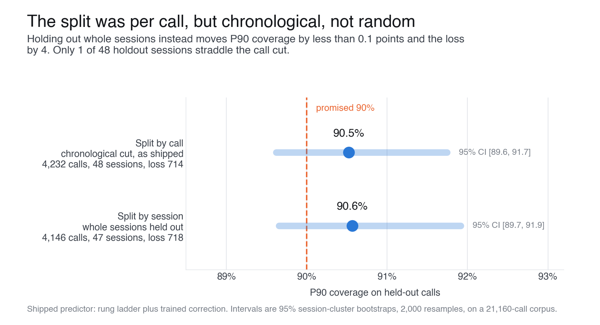
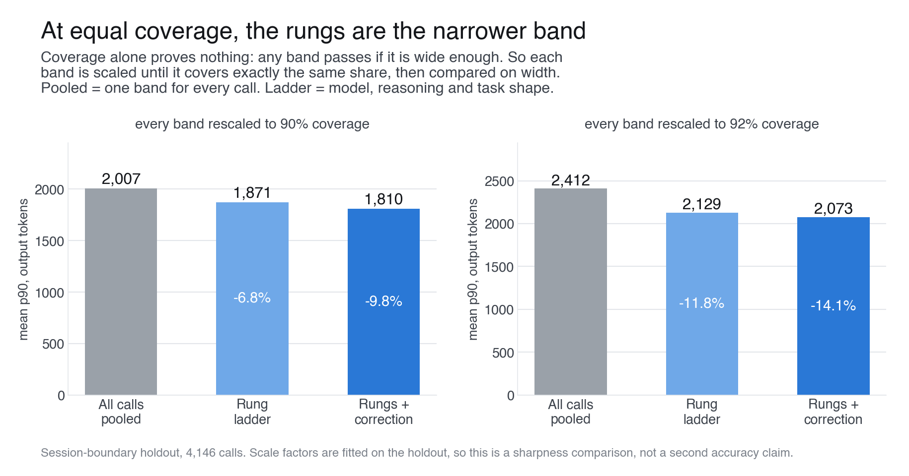
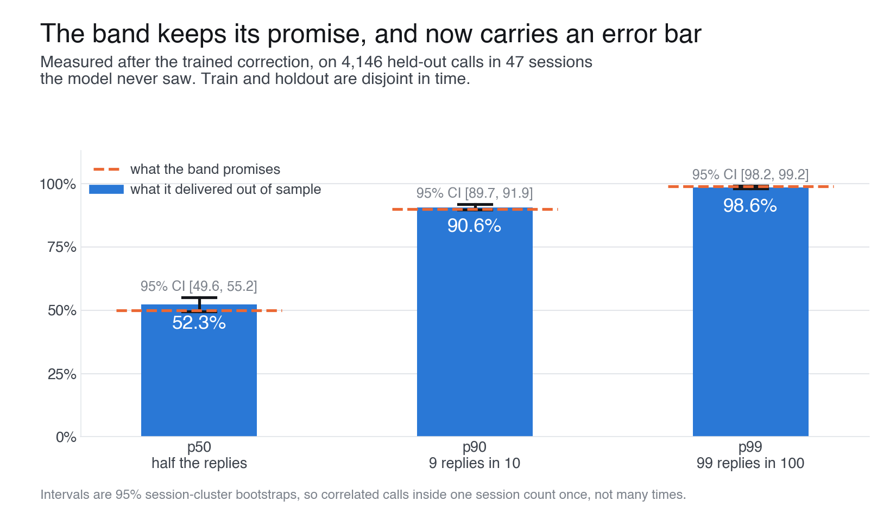
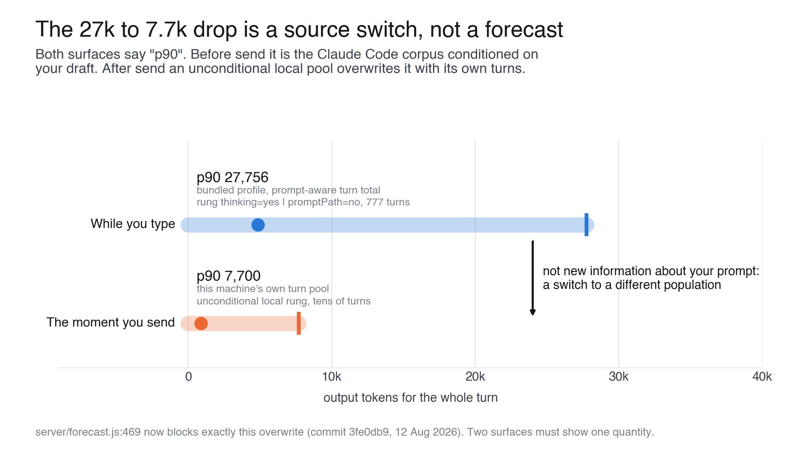
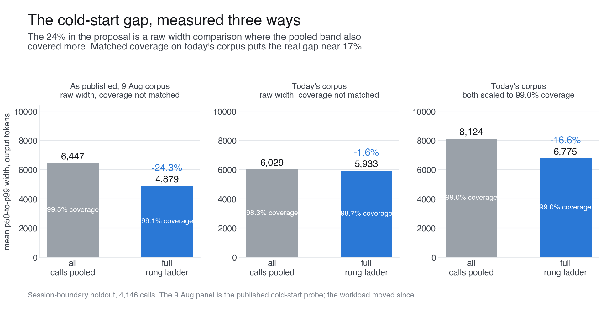
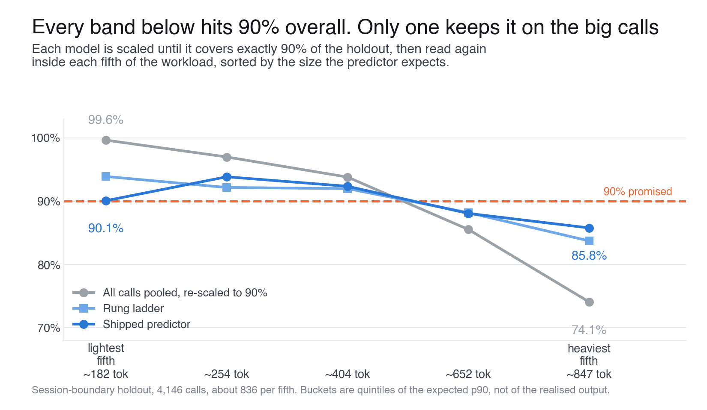

# Answers to the first review

Seven questions have come back on the proposal so far: four in the first pass, three
follow-ups. All of them now have numbers behind them.

**Reproduce everything:**

```bash
node experiments/evaluation/probe-reviewer-checks.mjs   # -> experiments/artifacts/reviewer-checks.json
python3 docs/report-assets/make-reviewer-answers.py     # -> docs/report-assets/reviewer-*.png (6 charts)
```

**Frozen run: 20 August 2026, 13:50 UTC, 21,160 calls in 402 sessions** of local
Claude Code history (`generatedAt` in `reviewer-checks.json`). Every number and
every chart below comes from that one run.

The corpus grows every day I work, so a re-run moves the figures by a few tenths
and the prose and the charts then disagree. Do NOT re-run before you send. If you
do re-run, re-render the charts and re-read every number in this file in the same
pass.

---

## Message to send (short version)

> Thanks, these are the right questions. I re-ran the eval for the first three
> and traced the fourth in the code. Numbers and charts below.
>
> **1. Per call or per session?** Per call, but the cut is chronological, not
> random: I sort every call by time and hold out the last 20%. Only 1 of the 48
> holdout sessions straddles the cut, so there is very little of the leak you are
> describing. I re-ran it with whole sessions held out anyway. P90 coverage moves
> from 90.5% to 90.6% and pinball loss from 714 to 718. The verdict does not
> depend on the split.
>
> The part of your point that does bite is the error bar, not the estimate:
> 4,232 held-out calls sit in only 48 sessions, so the effective sample size is
> much smaller than the call count suggests. Every confidence interval in the
> repo already resamples whole sessions rather than calls, but the coverage
> numbers were published bare. They now carry an interval: **P90 coverage 90.5%,
> 95% CI [89.6, 91.7]**.
>
> 
>
> **2. Sharpness.** You are right that "9 in 10 under p90" passes with any wide
> enough band. So I rescaled each band by a single constant until it covers
> exactly the same share of held-out calls, then compared widths:
>
> | at equal coverage | all calls pooled | rung ladder | rungs + correction |
> |---|---|---|---|
> | 90% coverage | 2,007 | 1,871 (-6.8%) | **1,810 (-9.8%)** |
> | 92% coverage | 2,412 | 2,129 (-11.7%) | **2,073 (-14.1%)** |
>
> So the honest claim is 7 to 14% sharper, not a factor. The larger effect is in
> pinball loss, 840 pooled to 718 shipped (-15%), because the ladder mostly moves
> the band to the right place per group rather than shrinking it.
>
> 
>
> **3. Before or after the correction?** After, and out of sample. The ladder and
> the correction are both fitted on the training slice only, and the holdout is
> strictly later in time. The correction is what moves P90 coverage from 89.5% to
> 90.6%.
>
> 
>
> **4. The 27k to 7.7k drop on send.** Good catch, and it is not the model
> changing its mind about the prompt. The two surfaces were reading two different
> populations under the same label "p90":
>
> - while you type: the bundled Claude Code corpus, conditioned on your draft
>   (rung `thinking=yes | promptPath=no`, 777 turns, p90 27,756)
> - the moment you send: an unconditional pool of that machine's own past turns,
>   which are much shorter, so it overwrites the number with 7.7k
>
> A guard now blocks exactly that overwrite: a prompt-conditioned turn forecast
> can no longer be replaced by an unconditional local rung
> (`server/forecast.js:469`, commit `3fe0db9`, 12 Aug 2026). If your recording
> predates that commit, this is the bug that commit fixed. Either way the
> underlying rule is the one you would expect: two surfaces, one quantity.
>
> 

---

## Message to send (follow-ups)

> **Is the 90.5% in the forest plot measured after the trained correction?** Yes.
> Both rows of that plot are the shipped predictor end to end: rung ladder plus
> the trained quantile correction, evaluated on calls it never trained on. The
> ladder alone lands at 89.5% and pooling everything lands at 88.1% on the same
> holdout, so the correction is what carries it from 89.5% to 90.6%. Nothing in
> that plot is a pre-correction number.
>
> **Is the cold-start 24% rescaled, or raw width?** Raw, and you were right to
> ask, because it does not survive the check. Three measurements of the same
> comparison:
>
> | | all calls pooled | full rung ladder | gap |
> |---|---|---|---|
> | as published, 9 Aug corpus, raw width | 6,447 at 99.5% coverage | 4,879 at 99.1% coverage | -24.3% |
> | today's corpus, raw width | 6,029 at 98.3% coverage | 5,933 at 98.7% coverage | -1.6% |
> | today's corpus, both scaled to 99.0% coverage | 8,124 | 6,775 | **-16.6%** |
>
> Two things went wrong with the published number. It compares raw p50-to-p99
> widths at coverages that are not equal, and the pooled band was the one
> covering more, which is exactly the trap you flagged on the p90 claim. And it
> comes from the 9 August corpus; the workload moved since, and the same raw
> comparison today gives -1.6%.
>
> The number I would now stand behind is **-16.6% at matched 99% coverage**. I am
> replacing 24% with 17% everywhere.
>
> 

---

## Message to send (follow-up: conditional coverage)

> **Does the 90% hold on the expensive calls, or only on average?** It mostly
> holds, and this is the check that separates the models. I scaled every band by
> one constant until each covers exactly 90% of the holdout, then read the
> coverage again inside each fifth of the workload, sorted by the size the
> predictor expects before the call:
>
> | coverage inside each fifth | lightest | 2nd | 3rd | 4th | heaviest |
> |---|---|---|---|---|---|
> | all calls pooled | 99.6% | 97.0% | 93.8% | 85.5% | 74.1% |
> | rung ladder | 93.9% | 92.2% | 92.0% | 88.2% | 83.7% |
> | rungs + correction | **90.1%** | 93.8% | 92.3% | 88.1% | **85.8%** |
>
> The pooled band is the honest control here. It passes the headline test at 90%
> overall, and it gets there by covering the cheap calls 99.6% of the time and
> missing one heavy call in four. That is the failure a single average number
> cannot show, and it is the reason for the rungs.
>
> The shipped predictor is not flat either. On the heaviest fifth it covers 85.8%
> [82.9, 89.2], and that interval excludes 90, so the shortfall is real and not
> sampling noise. I am not claiming a calibrated band inside every bucket. I am
> claiming the tilt drops from 25 points to 4, and I would rather show you the
> remaining 4 than average them away.
>
> One method note, because it changes the reading: the buckets are quintiles of
> the **expected** p90, not of the realised output. Bucketing on the realised
> output would put the largest replies in the top bucket by construction, no band
> could cover them, and the chart would measure nothing.
>
> 

---

## Message to send (one paragraph, if the thread is busy)

> Re-ran it. The holdout was per call but chronological, and switching to whole
> held-out sessions changes P90 coverage by 0.1 points (90.5%, 95% CI [89.6,
> 91.7] on 4,232 calls in 48 sessions), so the split was not carrying the result.
> That 90.5% is the full shipped predictor, correction included, out of sample.
> On sharpness: rescaling every band to the same coverage, the rung ladder plus
> correction is 9.8% narrower than pooling all calls at 90% coverage and 14.1%
> narrower at 92%, real but modest; the bigger win is 15% pinball loss, because
> the ladder moves the band rather than shrinking it. A pooled band also fails
> where it matters: rescaled to the same 90% overall, it covers 99.6% of the
> lightest fifth of calls and only 74.1% of the heaviest, while the shipped
> predictor holds 90.1% to 85.8% across that range. The cold-start 24% in the
> proposal was raw width at unmatched coverage on an older corpus; matched at 99%
> coverage today it is 17%, and I am changing the claim. And the 27k to 7.7k jump
> in the video is a source switch, not a forecast: the pre-send number is the
> bundled corpus conditioned on the draft, the post-send number was an
> unconditional pool of that machine's own turns overwriting it. That overwrite
> is now blocked in code.

---

## What changed in the write-up

- "9 in 10 under p90" is replaced by "90.5% [89.6, 91.7] on 4,232 held-out calls
  in 48 sessions, split by session".
- The matched-coverage sharpness table is added. It is the number that answers
  "any wide band passes".
- The conditional-coverage chart is added, and it opens the post. Overall
  coverage alone is not evidence: a pooled band passes it and still misses a
  quarter of the heavy calls.
- No sharpness claim above 14% for the warm case. The loss reduction carries the
  argument instead.
- The cold-start claim drops from 24% to 17%, and says "at matched coverage" out
  loud.

## Method notes

- **Split by session.** Sessions are ordered by their first call. Sessions fill
  the training set until it reaches the same size as the shipped 80% cut, and
  every remaining session goes to the holdout whole. No session appears on both
  sides.
- **Coverage intervals.** Session-cluster bootstrap, 2,000 resamples, fixed
  seed. Whole sessions are resampled with replacement, so correlated calls
  inside a session count once rather than many times. This is the same block
  bootstrap the repo already uses for its adoption decisions.
- **Matched-coverage sharpness.** Each model's p90 (or p99, for the cold-start
  chart) is multiplied by one constant, found by bisection, until holdout
  coverage hits the target exactly. The constants are fitted on the holdout, so
  this is a sharpness comparison and not a second accuracy claim. Stating it any
  other way would overclaim.
- **Cold-start tiers.** `pooled` is one band for every call, the tier
  `probe-cold-start.mjs` calls `overallOnly`. `ladder` walks
  `mtp -> path -> mt -> model`, the tier it calls `full`. The definitions are
  byte-identical in both scripts, so the difference between the 9 August panel
  and today's is corpus and holdout window, not method.
- **Conditional coverage.** Each model's p90 is scaled to exactly 90% holdout
  coverage by the same bisection as the sharpness table, then coverage is
  recomputed inside quintiles of the boosted p90, about 830 calls per bucket.
  Per-bucket 95% session-cluster intervals are in `conditional.models.*.buckets`
  of `reviewer-checks.json`. They are about 6 points wide. The heaviest bucket of
  the shipped predictor is 85.8% [82.9, 89.2], which excludes 90, so its
  shortfall there is real and not noise. The pooled tilt, 99.6% [99.1, 100] down
  to 74.1% [70.2, 79.1], is far outside any bootstrap noise.
- **Charts.** `docs/report-assets/make-reviewer-answers.py` reads
  `experiments/artifacts/reviewer-checks.json`. Every number in the charts comes
  from that file, except the 9 August panel of the cold-start chart, which comes
  from the published `cold-start-probe.json`, and the two turn-total quantiles in
  the scale-switch chart, which come from the bundled profile and the recording.
